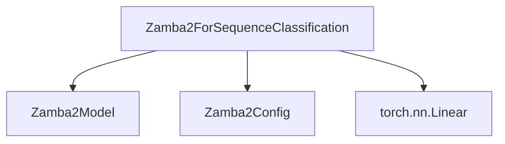

The `modeling_implementation` module provides the concrete implementation for sequence classification tasks using the Zamba2 model architecture. It specifically defines the `Zamba2ForSequenceClassification` class, which extends the base Zamba2 model with a classification head.

### Purpose and Core Functionality

The primary purpose of this module is to enable sequence classification with Zamba2 models. The `Zamba2ForSequenceClassification` class wraps the core `Zamba2Model` and adds a linear layer on top to produce classification logits. It handles the forward pass, including attention masking, position IDs, and caching, and computes the classification loss if labels are provided.

#### `Zamba2ForSequenceClassification`

This class is responsible for:
- Initializing the core `Zamba2Model` and a linear classification head.
- Performing a forward pass through the `Zamba2Model` to obtain hidden states.
- Applying the linear classification head to the pooled hidden states.
- Calculating the sequence classification/regression loss based on provided labels.
- Handling padding tokens for accurate pooling of logits, especially when batch sizes are greater than 1.

### Architecture and Component Relationships

The `modeling_implementation` module, as part of the `zamba2_models` family, relies on the `Zamba2Model` for its underlying transformer architecture and `Zamba2Config` for configuration details.

<!-- DIAGRAM_JSON
{
    "direction": "TD",
    "nodes": [
        {"id": "zamba2_for_sequence_classification", "label": "Zamba2ForSequenceClassification", "type": "component", "link": null},
        {"id": "zamba2_model", "label": "Zamba2Model", "type": "external", "link": "zamba2_models.md"},
        {"id": "zamba2_config", "label": "Zamba2Config", "type": "external", "link": "zamba2_models.md"},
        {"id": "nn_linear", "label": "torch.nn.Linear", "type": "external", "link": null}
    ],
    "edges": [
        {"source": "zamba2_for_sequence_classification", "target": "zamba2_model"},
        {"source": "zamba2_for_sequence_classification", "target": "zamba2_config"},
        {"source": "zamba2_for_sequence_classification", "target": "nn_linear"}
    ],
    "groups": []
}
-->

### How the Module Fits into the Overall System

The `modeling_implementation` module is a leaf module within the `zamba2_models` directory, specifically located under `zamba2_models/sequence_classification_models/`. It provides a specific task-oriented head (`Zamba2ForSequenceClassification`) that utilizes the general-purpose `Zamba2Model`. This allows for a modular design where the core Zamba2 architecture can be reused for various downstream tasks by simply attaching different heads.

It depends on the base Zamba2 components defined in the broader [zamba2_models](zamba2_models.md) module for its foundational model and configuration. This module is instantiated when a Zamba2 model needs to perform sequence classification, demonstrating how specialized functionalities are built upon shared core model components.