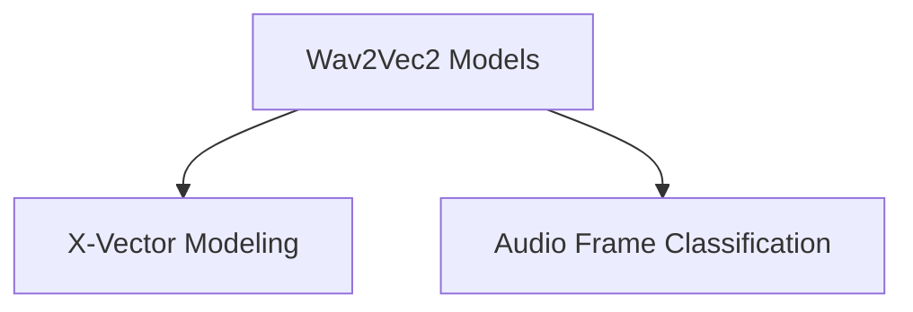
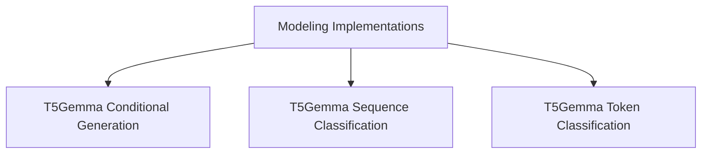

# Wav2Vec2 Modeling Implementations

This module (`modeling_implementations`) provides specific implementations of the Wav2Vec2 model for different downstream tasks, specifically X-vector extraction for speaker verification and audio frame classification. It extends the base Wav2Vec2 model with task-specific heads and loss functions.

## Architecture Overview

The `modeling_implementations` module is composed of two primary sub-modules:

-   **X-Vector Modeling**: Focuses on speaker verification by extracting X-vectors.
-   **Audio Frame Classification**: Handles classification tasks at the audio frame level.

These sub-modules build upon the core Wav2Vec2 model provided by the parent `wav2vec2_models` module to deliver specialized functionalities.

<!-- DIAGRAM_JSON
{
    "direction": "TD",
    "nodes": [
        {"id": "wav2vec2_models", "label": "Wav2Vec2 Models", "type": "external", "link": "wav2vec2_models.md"},
        {"id": "x_vector_modeling", "label": "X-Vector Modeling", "type": "module", "link": "x_vector_modeling.md"},
        {"id": "audio_frame_classification", "label": "Audio Frame Classification", "type": "module", "link": "audio_frame_classification.md"}
    ],
    "edges": [
        {"source": "wav2vec2_models", "target": "x_vector_modeling"},
        {"source": "wav2vec2_models", "target": "audio_frame_classification"}
    ],
    "groups": []
}
-->

## Sub-modules

*   [X-Vector Modeling](x_vector_modeling.md): Implements the Wav2Vec2 model for X-vector extraction and speaker verification tasks.
*   [Audio Frame Classification](audio_frame_classification.md): Provides the Wav2Vec2 model tailored for per-frame audio classification tasks.

The `modeling_implementations` module serves as a central hub for various model architectures and their specific task-oriented implementations within the Transformers library. This documentation focuses on the `T5Gemma` model implementations, showcasing its versatility across different natural language processing tasks.

## Architecture Overview

The T5Gemma model implementations are designed to handle a range of tasks, from conditional generation to sequence and token classification. The core architecture leverages either an encoder-decoder or an encoder-only configuration, depending on the specific task requirements. Each implementation builds upon the foundational T5Gemma model, extending it with task-specific heads and loss functions.

### Sub-modules

This module contains the following key sub-modules for T5Gemma implementations:

*   **[T5Gemma Conditional Generation](t5gemma_conditional_generation.md)**: Handles sequence-to-sequence tasks.
*   **[T5Gemma Sequence Classification](t5gemma_sequence_classification.md)**: Focuses on classifying entire input sequences.
*   **[T5Gemma Token Classification](t5gemma_token_classification.md)**: Designed for tasks requiring classification at the token level.

<!-- DIAGRAM_JSON
{
    "direction": "TD",
    "nodes": [
        {"id": "t5gemma_conditional_generation", "label": "T5Gemma Conditional Generation", "type": "module", "link": "t5gemma_conditional_generation.md"},
        {"id": "t5gemma_sequence_classification", "label": "T5Gemma Sequence Classification", "type": "module", "link": "t5gemma_sequence_classification.md"},
        {"id": "t5gemma_token_classification", "label": "T5Gemma Token Classification", "type": "module", "link": "t5gemma_token_classification.md"}
    ],
    "edges": [
        {"source": "modeling_implementations", "target": "t5gemma_conditional_generation"},
        {"source": "modeling_implementations", "target": "t5gemma_sequence_classification"},
        {"source": "modeling_implementations", "target": "t5gemma_token_classification"}
    ],
    "groups": []
}
-->

