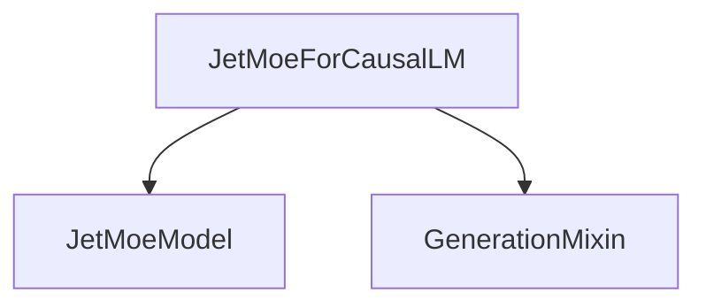

# Module: modeling_jetmoe_causal_lm

## Introduction

The `modeling_jetmoe_causal_lm` module provides the `JetMoeForCausalLM` class, an implementation of a causal language model utilizing the JetMoe architecture. This module is designed for tasks requiring text generation and sequence prediction, incorporating a Mixture-of-Experts (MoE) approach to enhance model capacity and efficiency.

## Core Functionality

The primary component of this module is `JetMoeForCausalLM`, which extends the capabilities of a base JetMoe model with a language modeling head and auxiliary loss computation for routing.

### `JetMoeForCausalLM`

*   **Purpose**: Implements a causal language model for the JetMoe architecture. It can be used for various natural language generation tasks.
*   **Key Features**:
    *   **Causal Language Modeling**: Generates text by predicting the next token in a sequence.
    *   **Mixture-of-Experts (MoE)**: Leverages an MoE layer within the `JetMoeModel` for efficient processing and increased model capacity.
    *   **Auxiliary Loss**: Includes a load-balancing auxiliary loss to encourage balanced expert usage during training, improving MoE performance.
    *   **Generation Capabilities**: Inherits from [generation_mixins.md]GenerationMixin, providing standard generation methods like `generate()`.
*   **Initialization**: Takes a `config` object to set up the model, including vocabulary size, auxiliary loss coefficient, and MoE-specific parameters (`num_local_experts`, `num_experts_per_tok`).
*   **Forward Pass**: Processes input sequences (`input_ids`, `attention_mask`, `position_ids`) to produce logits for next-token prediction. It can also compute the causal language modeling loss and an optional auxiliary loss based on router logits.

## Architecture and Component Relationships

The `modeling_jetmoe_causal_lm` module is a specialized component within the broader `jetmoe_models` ecosystem, focusing on causal language modeling.

<!-- DIAGRAM_JSON
{
    "direction": "TD",
    "nodes": [
        {"id": "jetmoe_for_causal_lm", "label": "JetMoeForCausalLM", "type": "component", "link": null},
        {"id": "jetmoe_model", "label": "JetMoeModel", "type": "external", "link": "jetmoe_models.md"},
        {"id": "generation_mixin", "label": "GenerationMixin", "type": "external", "link": "generation_mixins.md"}
    ],
    "edges": [
        {"source": "jetmoe_for_causal_lm", "target": "jetmoe_model"},
        {"source": "jetmoe_for_causal_lm", "target": "generation_mixin"}
    ],
    "groups": []
}
-->

*   **`JetMoeForCausalLM`**: This is the central class in this module. It encapsulates the core logic for causal language modeling.
*   **`JetMoeModel`**: An internal component initialized by `JetMoeForCausalLM`. It provides the base JetMoe architecture, including the Mixture-of-Experts (MoE) layers. For more details, refer to the [jetmoe_models.md] documentation.
*   **`GenerationMixin`**: `JetMoeForCausalLM` inherits from this mixin, providing common methods for text generation, such as beam search, sampling, and greedy decoding. See the [generation_mixins.md] documentation for further details.
*   **`lm_head`**: A linear layer that projects the hidden states from the `JetMoeModel` to the vocabulary space to produce logits for token prediction.
*   **`load_balancing_loss_func`**: A utility function (implicitly used in `forward` if `output_router_logits` is enabled) responsible for calculating the auxiliary loss to balance expert usage.

## Integration with the Overall System

The `modeling_jetmoe_causal_lm` module is a specialized model implementation within the `transformers` library. It integrates seamlessly with the Hugging Face ecosystem by:

*   **Standard Model Interface**: Adhering to the `PreTrainedModel` interface (via `JetMoePreTrainedModel`), allowing it to be loaded, saved, and used with standard `Trainer` classes.
*   **Generation API**: Leveraging `GenerationMixin` for a consistent and flexible generation API, enabling users to easily perform text generation with various strategies.
*   **Configuration**: Using a `config` object for model parameters, allowing for easy configuration and reproducibility.
*   **MoE Integration**: Provides a complete MoE-enabled causal language model, fitting into scenarios where scalable and efficient language generation is required.

It primarily serves as a concrete implementation of a causal language model for the JetMoe architecture, making it accessible for researchers and developers to utilize and extend.