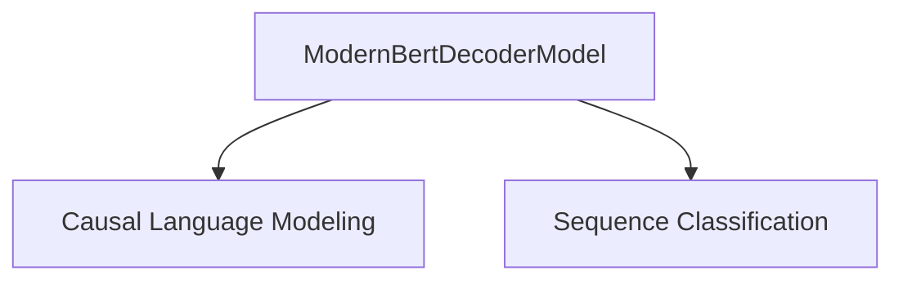

# ModernBert Decoder Implementations

This module (`modernbert_decoder_implementations`) provides concrete implementations of the ModernBert Decoder model for various downstream tasks. It leverages the core ModernBert Decoder architecture to offer specialized functionalities such as causal language modeling and sequence classification. This documentation details the structure, purpose, and key components of these implementations.

## Architecture Overview

The `modernbert_decoder_implementations` module is structured around different task-specific heads built on top of the shared `ModernBertDecoderModel`. The current implementations include:

<!-- DIAGRAM_JSON
{
    "direction": "TD",
    "nodes": [
        {"id": "modernbert_decoder_model", "label": "ModernBertDecoderModel", "type": "external"},
        {"id": "causal_lm", "label": "Causal Language Modeling", "type": "module", "link": "causal_lm.md"},
        {"id": "sequence_classification", "label": "Sequence Classification", "type": "module", "link": "sequence_classification.md"}
    ],
    "edges": [
        {"source": "modernbert_decoder_model", "target": "causal_lm"},
        {"source": "modernbert_decoder_model", "target": "sequence_classification"}
    ],
    "groups": []
}
-->

## Sub-modules

This module contains the following key sub-modules:

*   **[Causal Language Modeling](causal_lm.md)**: Implements the `ModernBertDecoderForCausalLM` for text generation and other causal language modeling tasks. It includes the `lm_head` and `decoder` layers for predicting the next token in a sequence.

*   **[Sequence Classification](sequence_classification.md)**: Provides the `ModernBertDecoderForSequenceClassification` for various sequence classification or regression tasks. It utilizes a classification head and dropout layers to produce logits for sequence-level predictions.

For detailed information on each sub-module, refer to their respective documentation files.