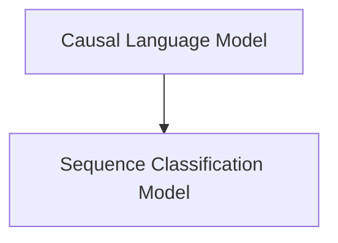

# ModernBert Decoder Modeling Components

This document provides a comprehensive overview of the `modeling_components` sub-module within the `modernbert_decoder_models` module. It focuses on the core model implementations for causal language modeling and sequence classification tasks, building upon the ModernBertDecoder architecture.

## Architecture Overview

The `modeling_components` module is structured to provide distinct model implementations tailored for specific NLP tasks. It leverages the foundational `ModernBertDecoderModel` and extends it with task-specific heads for causal language modeling and sequence classification. The architecture is designed for modularity, allowing for clear separation of concerns.

<!-- DIAGRAM_JSON
{
    "direction": "TD",
    "nodes": [
        {"id": "modernbert_decoder_causal_lm_model", "label": "Causal Language Model", "type": "module", "link": "modernbert_decoder_causal_lm_model.md"},
        {"id": "modernbert_decoder_sequence_classification_model", "label": "Sequence Classification Model", "type": "module", "link": "modernbert_decoder_sequence_classification_model.md"}
    ],
    "edges": [
        {"source": "modernbert_decoder_causal_lm_model", "target": "modernbert_decoder_sequence_classification_model", "label": "can be used in conjunction with"}
    ],
    "groups": []
}
-->

## High-Level Functionality

*   **Causal Language Model** ([modernbert_decoder_causal_lm_model.md](modernbert_decoder_causal_lm_model.md)): Implements the `ModernBertDecoderForCausalLM` class, which is designed for tasks requiring auto-regressive text generation, such as language modeling and text completion. It provides an `lm_head` for predicting the next token in a sequence.

*   **Sequence Classification Model** ([modernbert_decoder_sequence_classification_model.md](modernbert_decoder_sequence_classification_model.md)): Implements the `ModernBertDecoderForSequenceClassification` class, used for classifying entire input sequences. This model supports both single-label and multi-label classification, as well as regression tasks, by configuring the appropriate loss function based on the number of labels and problem type.