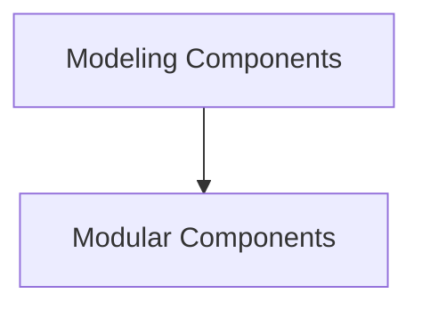

# ModernBertDecoder Models

## Introduction

The `modernbert_decoder_models` module provides implementations of the ModernBertDecoder architecture, specializing in both sequence classification and causal language modeling tasks. This module offers both standard modeling components and modular components for flexible integration and use within larger systems.

## Architecture Overview

The module is structured into two main sub-modules: `modeling_components` and `modular_components`. Each sub-module contains implementations for sequence classification and causal language modeling based on the ModernBertDecoder.

<!-- DIAGRAM_JSON
{
    "direction": "TD",
    "nodes": [
        {"id": "modeling_components", "label": "Modeling Components", "type": "module", "link": "modeling_components.md"},
        {"id": "modular_components", "label": "Modular Components", "type": "module", "link": "modular_components.md"}
    ],
    "edges": [
        {"source": "modeling_components", "target": "modular_components"}
    ],
    "groups": []
}
-->

## Sub-modules

*   [Modeling Components](modeling_components.md): Contains the core ModernBertDecoder model implementations.
*   [Modular Components](modular_components.md): Provides modular ModernBertDecoder model implementations.