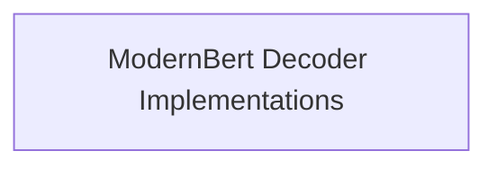

# ModernBert Decoder Modular Components

This module, `modernbert_decoder`, provides modular implementations for the ModernBert Decoder model, focusing on both sequence classification and causal language modeling tasks. It encapsulates the core logic for these functionalities, allowing for flexible integration and extension within larger systems.

## Architecture Overview

The `modernbert_decoder` module is structured to clearly separate its main functionalities into logical sub-modules. The primary sub-module, `modernbert_decoder_implementations`, contains the concrete implementations of the ModernBert Decoder for different tasks.

<!-- DIAGRAM_JSON
{
    "direction": "TD",
    "nodes": [
        {"id": "modernbert_decoder_implementations", "label": "ModernBert Decoder Implementations", "type": "module", "link": "modernbert_decoder_implementations.md"}
    ],
    "edges": [],
    "groups": []
}
-->

## Sub-modules

### [ModernBert Decoder Implementations](modernbert_decoder_implementations.md)
This sub-module contains the core implementations of ModernBert Decoder for sequence classification and causal language modeling. It includes the `ModernBertDecoderForSequenceClassification` and `ModernBertDecoderForCausalLM` components, which are essential for leveraging the ModernBert Decoder for various natural language processing tasks.