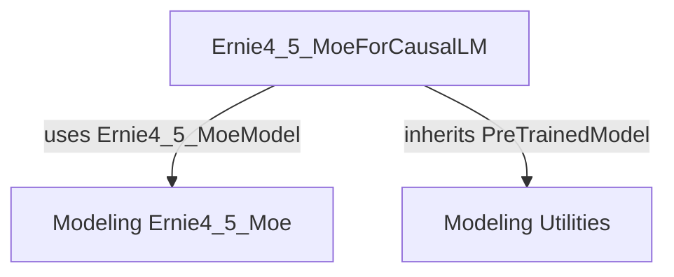

# Module: `modular_ernie4_5_moe`

## Introduction

The `modular_ernie4_5_moe` module provides a modular implementation of the Ernie 4.5 Mixture-of-Experts (MoE) model for causal language modeling. It focuses on the `Ernie4_5_MoeForCausalLM` class, which extends the functionality of a base causal language model with Ernie's specific MoE architecture.

## Architecture and Core Components

The `modular_ernie4_5_moe` module primarily encapsulates the `Ernie4_5_MoeForCausalLM` model. This class is designed to handle causal language modeling tasks leveraging a Mixture-of-Experts approach, allowing for more efficient and performant models.

### `Ernie4_5_MoeForCausalLM`

`Ernie4_5_MoeForCausalLM` is the central component of this module. It inherits from a base causal language model (specifically `MixtralForCausalLM`, indicating a shared architectural foundation with Mixtral models) and integrates the Ernie 4.5 MoE model for its core processing.

**Key features:**
*   **Causal Language Modeling:** Generates text sequence by sequence.
*   **Mixture-of-Experts (MoE) Architecture:** Incorporates multiple "expert" networks, with a router mechanism (`moe_num_experts`, `moe_k`) to dynamically select which experts process different parts of the input, enhancing model capacity and efficiency.
*   **Router Auxiliary Loss:** Includes a `router_aux_loss_coef` to guide the training of the expert routing mechanism.

### Component Relationships and Dependencies

The `Ernie4_5_MoeForCausalLM` component relies on the following:

*   **`Ernie4_5_MoeModel`**: The core MoE model implementation, which is likely defined within the sibling `modeling_ernie4_5_moe` module. This provides the fundamental building blocks of the Ernie 4.5 MoE architecture.
*   **`PreTrainedModel`**: Inherits from this utility class provided by the [Modeling Utilities module](modeling_utilities.md), ensuring compatibility with the Hugging Face Transformers ecosystem for loading, saving, and managing pre-trained models.
*   **Configuration (`config`)**: The model's behavior and structure are determined by a configuration object, which specifies parameters such as `vocab_size`, `hidden_size`, `use_bias`, `router_aux_loss_coef`, `moe_num_experts`, and `moe_k`.

<!-- DIAGRAM_JSON
{
    "direction": "TD",
    "nodes": [
        {"id": "ernie4_5_moe_causal_lm", "label": "Ernie4_5_MoeForCausalLM", "type": "component", "link": null},
        {"id": "modeling_ernie4_5_moe", "label": "Modeling Ernie4_5_Moe", "type": "external", "link": "modeling_ernie4_5_moe.md"},
        {"id": "modeling_utils", "label": "Modeling Utilities", "type": "external", "link": "modeling_utilities.md"}
    ],
    "edges": [
        {"source": "ernie4_5_moe_causal_lm", "target": "modeling_ernie4_5_moe", "label": "uses Ernie4_5_MoeModel"},
        {"source": "ernie4_5_moe_causal_lm", "target": "modeling_utils", "label": "inherits PreTrainedModel"}
    ],
    "groups": []
}
-->

## How the Module Fits into the Overall System

The `modular_ernie4_5_moe` module is a specialized model implementation within the broader `ernie4_5_moe_models` family. It provides a specific MoE-enabled causal language model, `Ernie4_5_MoeForCausalLM`, ready for integration into various natural language processing pipelines. It leverages general utilities from `modeling_utilities` and relies on the core `Ernie4_5_MoeModel` (likely from `modeling_ernie4_5_moe`) to function. This modular design allows for independent development and maintenance of the specific Ernie 4.5 MoE architecture while reusing common functionalities across the Transformers library.

Developers can instantiate `Ernie4_5_MoeForCausalLM` directly to perform causal text generation tasks, benefiting from the MoE architecture for enhanced performance on large-scale datasets. It plays a crucial role in expanding the library's support for advanced MoE-based language models.
