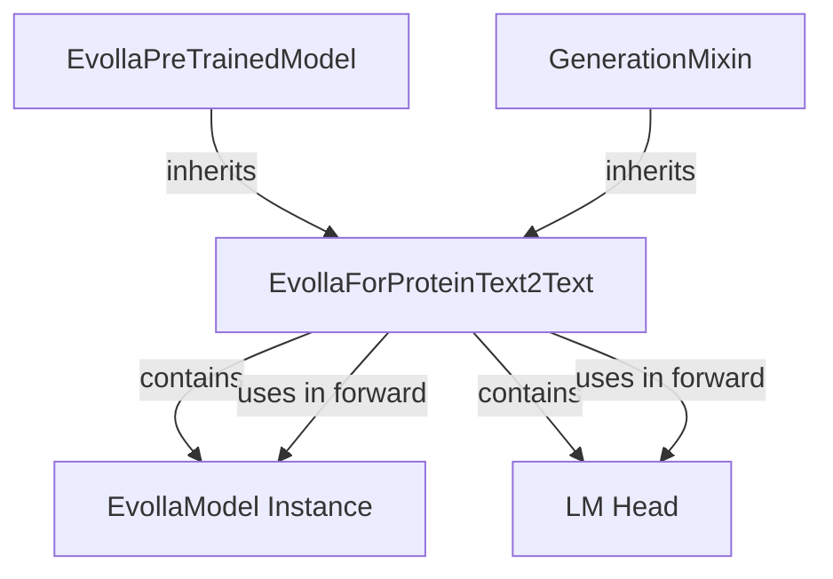

# Module: modular_evolla_implementation

## Introduction

The `modular_evolla_implementation` module provides the core `EvollaForProteinText2Text` model, which is designed for protein-aware text-to-text generation tasks. This module is a key component within the larger `evolla_models` ecosystem, specializing in generating text responses based on both textual input and protein sequence information.

## Comprehensive Documentation

### Purpose and Core Functionality

The primary purpose of `modular_evolla_implementation` is to offer a modular and extensible implementation of the Evolla model specifically tailored for protein-related text generation. The `EvollaForProteinText2Text` class is a powerful tool for tasks where understanding and generating text based on protein sequences (e.g., amino acid sequences, foldseek data) is crucial.

It achieves this by combining a base Evolla model with a language modeling head, allowing it to process both standard text inputs and specialized protein inputs to produce coherent and contextually relevant text outputs.

### Architecture and Component Relationships

The `EvollaForProteinText2Text` model is built upon a modular architecture:

*   **`EvollaForProteinText2Text`**: The main class, responsible for orchestrating the text and protein input processing and text generation.
*   **`EvollaModel`**: An internal component (instantiated as `self.model`) that handles the core feature extraction and representation learning from both text and protein inputs. This model's definition is typically found within the [modeling_evolla.md](modeling_evolla.md) module.
*   **`lm_head`**: A linear layer that projects the hidden states from the `EvollaModel` to the vocabulary size, enabling the generation of output tokens.

It inherits functionality from:

*   **`EvollaPreTrainedModel`**: Provides common pre-trained model functionalities and weight initialization. This base class is defined in [modeling_evolla.md](modeling_evolla.md).
*   **`GenerationMixin`**: Offers standard text generation methods (e.g., `generate`), allowing the model to leverage various decoding strategies. This mixin is part of the [generation_mixins.md](generation_mixins.md) module.

The `forward` method of `EvollaForProteinText2Text` processes `input_ids`, `attention_mask`, `protein_input_ids`, and `protein_attention_mask` through its internal `EvollaModel` and then uses the `lm_head` to compute logits for text generation. It can also compute a loss if `labels` are provided.

### How the Module Fits into the Overall System

The `modular_evolla_implementation` module, specifically `EvollaForProteinText2Text`, is a specialized application within the broader `evolla_models` family. It serves as an end-to-end solution for protein-text interaction tasks, bridging the gap between biological sequence data and natural language processing. It relies on shared utilities like `GenerationMixin` for common generation capabilities and `EvollaPreTrainedModel` for consistent model loading and saving mechanisms across different Evolla model variants.

Users typically interact with this model alongside an `EvollaProcessor` (not detailed in this module's core components but essential for preparing inputs), which handles the tokenization of text and the processing of protein information into the `protein_input_ids` and `protein_attention_mask` expected by the model.

<!-- DIAGRAM_JSON
{
    "direction": "TD",
    "nodes": [
        {"id": "evolla_for_protein_text_to_text", "label": "EvollaForProteinText2Text", "type": "component", "link": null},
        {"id": "evolla_model_instance", "label": "EvollaModel Instance", "type": "component", "link": null},
        {"id": "lm_head_component", "label": "LM Head", "type": "component", "link": null},
        {"id": "evolla_pretrained_model", "label": "EvollaPreTrainedModel", "type": "external", "link": "modeling_evolla.md"},
        {"id": "generation_mixin", "label": "GenerationMixin", "type": "external", "link": "generation_mixins.md"}
    ],
    "edges": [
        {"source": "evolla_for_protein_text_to_text", "target": "evolla_model_instance", "label": "contains"},
        {"source": "evolla_for_protein_text_to_text", "target": "lm_head_component", "label": "contains"},
        {"source": "evolla_pretrained_model", "target": "evolla_for_protein_text_to_text", "label": "inherits"},
        {"source": "generation_mixin", "target": "evolla_for_protein_text_to_text", "label": "inherits"},
        {"source": "evolla_for_protein_text_to_text", "target": "evolla_model_instance", "label": "uses in forward"},
        {"source": "evolla_for_protein_text_to_text", "target": "lm_head_component", "label": "uses in forward"}
    ],
    "groups": []
}
-->

