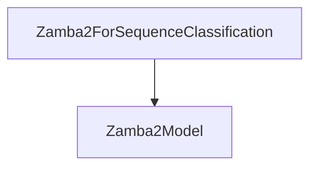

# modular_implementation

## Introduction
The `modular_implementation` module, located within the `zamba2_models.sequence_classification_models` directory, provides the core implementation for sequence classification tasks using the Zamba2 model architecture. It specifically defines the `Zamba2ForSequenceClassification` class, which extends the base `ZambaForSequenceClassification` to provide a modular and extensible approach to sequence classification.

## Core Functionality

### Zamba2ForSequenceClassification
The `Zamba2ForSequenceClassification` class is designed for performing sequence classification tasks using the Zamba2 model. It leverages the `Zamba2Model` for the underlying transformer operations and adds a classification head.

**Key Features:**
- **Inheritance**: Extends `ZambaForSequenceClassification`, inheriting common functionalities and providing a specialized implementation for Zamba2.
- **Model Integration**: Integrates `Zamba2Model` to handle the core transformer logic, ensuring efficient and accurate feature extraction from input sequences.
- **Classification Head**: Applies a scoring mechanism (`self.score`) on the hidden states produced by the `Zamba2Model` to generate logits for classification.
- **Loss Calculation**: Computes the appropriate loss (Mean-Square for regression or Cross-Entropy for classification) based on the `config.num_labels` and provided labels.
- **Padding Handling**: Includes logic to identify the last non-padding token for accurate pooling of logits, which is crucial for variable-length sequences.

#### `__init__(self, config: Zamba2Config)`
Initializes the `Zamba2ForSequenceClassification` instance.
- `config`: A `Zamba2Config` object containing the model's configuration, including `num_labels` and `pad_token_id`.
It initializes the base class and sets up the `Zamba2Model` component.

#### `forward(...)`
Performs the forward pass for sequence classification.

**Parameters:**
- `input_ids` (`torch.LongTensor`, *optional*): Input token IDs.
- `attention_mask` (`torch.Tensor`, *optional*): Mask to avoid performing attention on padding token indices.
- `position_ids` (`torch.LongTensor`, *optional*): Positional embeddings.
- `past_key_values` (`Cache`, *optional*): Cached key and value states for attention.
- `inputs_embeds` (`torch.FloatTensor`, *optional*): Directly provided embeddings.
- `labels` (`torch.LongTensor`, *optional*): Labels for computing the loss.
- `use_cache` (`bool`, *optional*): Whether or not to use the past key/values.
- `logits_to_keep` (`int | torch.Tensor`, *optional*, defaults to 0): Not explicitly used in the provided code snippet, likely for compatibility.

**Returns:**
- `tuple` or `SequenceClassifierOutputWithPast`: An object containing:
    - `loss`: The calculated classification loss (if `labels` are provided).
    - `logits`: The pooled logits for classification.
    - `past_key_values`: The cached key and value states.
    - `hidden_states`: Hidden states from the transformer model.
    - `attentions`: Attention weights from the transformer model.

The `forward` method first passes the inputs through the `Zamba2Model` to obtain transformer outputs. It then applies the classification head, pools the logits (considering padding tokens if `input_ids` are available), and calculates the loss if `labels` are provided.

## Architecture and Component Relationships

The `modular_implementation` module's primary component, `Zamba2ForSequenceClassification`, relies on the `Zamba2Model` for its core transformer functionalities.

<!-- DIAGRAM_JSON
{
    "direction": "TD",
    "nodes": [
        {"id": "zamba2_for_seq_classification", "label": "Zamba2ForSequenceClassification", "type": "component", "link": null},
        {"id": "zamba2_model", "label": "Zamba2Model", "type": "external", "link": "zamba2_models.md"}
    ],
    "edges": [
        {"source": "zamba2_for_seq_classification", "target": "zamba2_model"}
    ],
    "groups": []
}
-->

## How the Module Fits into the Overall System
The `modular_implementation` module is a crucial part of the `zamba2_models` ecosystem, specifically handling sequence classification tasks. It provides a specialized and modular implementation that integrates with the broader Zamba2 model architecture. By separating the core model logic (`Zamba2Model`) from the task-specific classification head, it promotes reusability and maintainability within the Zamba2 model family. This module contributes to the Zamba2 model's ability to perform diverse NLP tasks beyond just causal language modeling, extending its applicability to various classification challenges.
