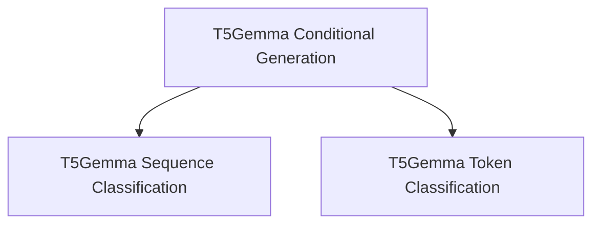

# Modular Implementations

## Introduction
The `modular_implementations` module provides highly adaptable and modular implementations for various T5Gemma model functionalities. This module focuses on specific task-oriented applications, including conditional generation, sequence classification, and token classification, allowing for flexible integration and extension within larger systems.

## Architecture Overview
The module is structured around specialized T5Gemma models, each tailored for a distinct task. These models leverage the core T5Gemma architecture, extending it with task-specific heads and logic. The design promotes reusability and clear separation of concerns, ensuring that each implementation can operate independently while adhering to a unified base model.

<!-- DIAGRAM_JSON
{
    "direction": "TD",
    "nodes": [
        {"id": "t5gemma_conditional_generation", "label": "T5Gemma Conditional Generation", "type": "module", "link": "t5gemma_conditional_generation.md"},
        {"id": "t5gemma_sequence_classification", "label": "T5Gemma Sequence Classification", "type": "module", "link": "t5gemma_sequence_classification.md"},
        {"id": "t5gemma_token_classification", "label": "T5Gemma Token Classification", "type": "module", "link": "t5gemma_token_classification.md"}
    ],
    "edges": [
        {"source": "t5gemma_conditional_generation", "target": "t5gemma_sequence_classification"},
        {"source": "t5gemma_conditional_generation", "target": "t5gemma_token_classification"}
    ],
    "groups": []
}
-->

## Sub-modules

*   ### [T5Gemma Conditional Generation](t5gemma_conditional_generation.md)
    This sub-module focuses on generating text conditionally, leveraging the T5Gemma model's encoder-decoder capabilities. It includes functionalities for sequence-to-sequence tasks, where an input sequence is transformed into an output sequence based on specific conditions.

*   ### [T5Gemma Sequence Classification](t5gemma_sequence_classification.md)
    This sub-module provides an implementation of T5Gemma for classifying entire input sequences. It supports various sequence classification tasks, determining the category or label of a given text input.

*   ### [T5Gemma Token Classification](t5gemma_token_classification.md)
    This sub-module enables token-level classification using the T5Gemma model. It is designed for tasks where each token in an input sequence needs to be classified individually, such as named entity recognition or part-of-speech tagging.
