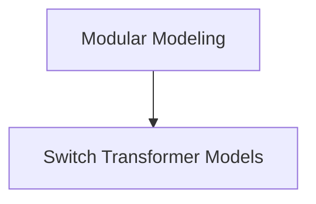

# Modular Modeling

The `modular_modeling` module focuses on providing a flexible and extensible framework for constructing transformer-based models, particularly those leveraging the Switch Transformer architecture.

## Architecture

The module is structured to separate concerns, allowing for independent development and easier maintenance of core model components.

<!-- DIAGRAM_JSON
{
    "direction": "TD",
    "nodes": [
        {"id": "modular_modeling", "label": "Modular Modeling", "type": "module", "link": "modular_modeling.md"},
        {"id": "switch_transformer_models", "label": "Switch Transformer Models", "type": "module", "link": "switch_transformer_models.md"}
    ],
    "edges": [
        {"source": "modular_modeling", "target": "switch_transformer_models"}
    ],
    "groups": []
}
-->

## Sub-modules

### [Switch Transformer Models](switch_transformer_models.md)
This sub-module contains the core implementations of the Switch Transformer architecture, including the full encoder-decoder model and the encoder-only model. It provides the foundational building blocks for creating modular transformer models.