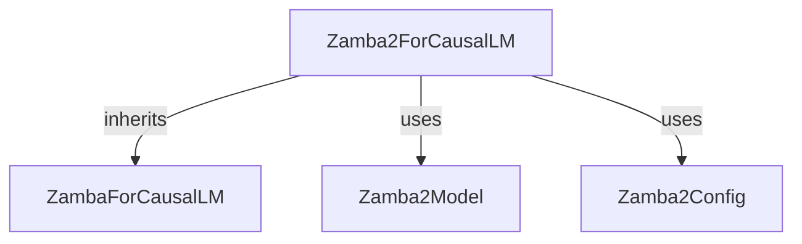

# modular_zamba2_causal_lm

## Introduction
This module implements the `Zamba2ForCausalLM` class, which extends the base `ZambaForCausalLM` to provide causal language modeling capabilities specifically for the Zamba2 architecture. It serves as the primary interface for utilizing the Zamba2 model for generative text tasks.

## Architecture and Component Relationships

<!-- DIAGRAM_JSON
{
    "direction": "TD",
    "nodes": [
        {"id": "zamba2_for_causal_lm", "label": "Zamba2ForCausalLM", "type": "component", "link": null},
        {"id": "zamba_for_causal_lm", "label": "ZambaForCausalLM", "type": "external", "link": "zamba_models.md"},
        {"id": "zamba2_model", "label": "Zamba2Model", "type": "external", "link": "zamba2_models.md"},
        {"id": "zamba2_config", "label": "Zamba2Config", "type": "external", "link": "zamba2_models.md"}
    ],
    "edges": [
        {"source": "zamba2_for_causal_lm", "target": "zamba_for_causal_lm", "label": "inherits"},
        {"source": "zamba2_for_causal_lm", "target": "zamba2_model", "label": "uses"},
        {"source": "zamba2_for_causal_lm", "target": "zamba2_config", "label": "uses"}
    ],
    "groups": []
}
-->

The `Zamba2ForCausalLM` is the core component of this module. It inherits from `ZambaForCausalLM` (defined in the [zamba_models](zamba_models.md) module), providing a foundation for causal language modeling. Internally, it composes a `Zamba2Model` and is configured using a `Zamba2Config` object, both of which are central to the overall [zamba2_models](zamba2_models.md) architecture.

## How the module fits into the overall system

The `modular_zamba2_causal_lm` module is a specialized component within the larger `zamba2_models` ecosystem. It provides the concrete implementation for a Zamba2-based causal language model, making it suitable for tasks like text generation, completion, and other autoregressive language understanding applications. Its integration with `ZambaForCausalLM` ensures compatibility and leverages the foundational elements of the broader Zamba model family, while `Zamba2Model` and `Zamba2Config` tailor its behavior to the specific advancements and characteristics of the Zamba2 architecture. This module is typically used by higher-level pipelines or applications that require a Zamba2 causal language model.