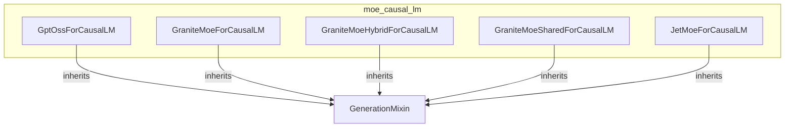

# moe_causal_lm
This module provides a collection of Mixture-of-Experts (MoE) causal language models, each designed for text generation by extending a base model with a language modeling head.

<!-- DIAGRAM_JSON
{
  "nodes": [
    {"id": "GptOssForCausalLM", "label": "GptOssForCausalLM"},
    {"id": "GraniteMoeForCausalLM", "label": "GraniteMoeForCausalLM"},
    {"id": "GraniteMoeHybridForCausalLM", "label": "GraniteMoeHybridForCausalLM"},
    {"id": "GraniteMoeSharedForCausalLM", "label": "GraniteMoeSharedForCausalLM"},
    {"id": "JetMoeForCausalLM", "label": "JetMoeForCausalLM"},
    {"id": "GenerationMixin", "label": "GenerationMixin", "style": "dashed"}
  ],
  "edges": [
    {"source": "GptOssForCausalLM", "target": "GenerationMixin", "label": "inherits"},
    {"source": "GraniteMoeForCausalLM", "target": "GenerationMixin", "label": "inherits"},
    {"source": "GraniteMoeHybridForCausalLM", "target": "GenerationMixin", "label": "inherits"},
    {"source": "GraniteMoeSharedForCausalLM", "target": "GenerationMixin", "label": "inherits"},
    {"source": "JetMoeForCausalLM", "target": "GenerationMixin", "label": "inherits"}
  ],
  "groups": [
    {"id": "moe_causal_lm", "label": "moe_causal_lm", "nodes": ["GptOssForCausalLM", "GraniteMoeForCausalLM", "GraniteMoeHybridForCausalLM", "GraniteMoeSharedForCausalLM", "JetMoeForCausalLM"]}
  ]
}
-->
