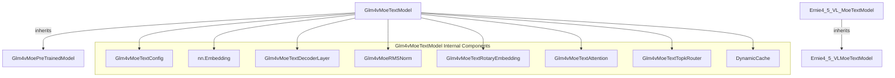

# moe_text_models
This module defines text model components for Mixture-of-Experts (MoE) architectures, featuring a deprecated Ernie model and a comprehensive Glm4v MoE text model with various sub-components.

<!-- DIAGRAM_JSON
{
  "nodes": [
    {"id": "A", "label": "Ernie4_5_VL_MoeTextModel"},
    {"id": "B", "label": "Ernie4_5_VLMoeTextModel"},
    {"id": "C", "label": "Glm4vMoeTextModel"},
    {"id": "D", "label": "Glm4vMoePreTrainedModel"},
    {"id": "E", "label": "Glm4vMoeTextConfig"},
    {"id": "F", "label": "nn.Embedding"},
    {"id": "G", "label": "Glm4vMoeTextDecoderLayer"},
    {"id": "H", "label": "Glm4vMoeRMSNorm"},
    {"id": "I", "label": "Glm4vMoeTextRotaryEmbedding"},
    {"id": "J", "label": "Glm4vMoeTextAttention"},
    {"id": "K", "label": "Glm4vMoeTextTopkRouter"},
    {"id": "L", "label": "DynamicCache"}
  ],
  "edges": [
    {"source": "A", "target": "B", "type": "inheritance"},
    {"source": "C", "target": "D", "type": "inheritance"},
    {"source": "C", "target": "E", "type": "composition"},
    {"source": "C", "target": "F", "type": "composition"},
    {"source": "C", "target": "G", "type": "composition"},
    {"source": "C", "target": "H", "type": "composition"},
    {"source": "C", "target": "I", "type": "composition"},
    {"source": "C", "target": "J", "type": "composition"},
    {"source": "C", "target": "K", "type": "composition"},
    {"source": "C", "target": "L", "type": "usage"}
  ],
  "groups": [
    {"id": "Glm4vMoeTextModel_Components", "label": "Glm4vMoeTextModel Internal Components", "nodes": ["E", "F", "G", "H", "I", "J", "K", "L"]}
  ]
}
-->
```
