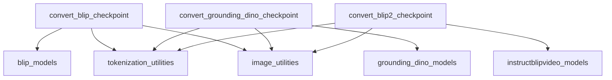

# `multimodal_converters` Module Documentation

## Introduction
The `multimodal_converters` module is a crucial component within the model conversion utilities, specifically designed to facilitate the conversion of pre-trained multimodal models from their original frameworks (e.g., Hugging Face, original PyTorch implementations) into a standardized format compatible with the current system. This module handles the intricate process of weight mapping, configuration adaptation, and verification for various multimodal architectures, ensuring seamless integration and usability across different platforms.

## Core Functionality
The primary responsibility of `multimodal_converters` is to provide robust conversion utilities for popular multimodal models. It encompasses functions that take original model checkpoints and transform them into a format suitable for the system's inference and fine-tuning pipelines. This involves:

1.  **Weight Renaming and Mapping**: Adapting the naming conventions of model parameters from the source framework to match the target architecture.
2.  **Configuration Alignment**: Ensuring that model configurations (e.g., hidden dimensions, attention heads) are correctly transferred and aligned.
3.  **State Dictionary Loading**: Loading the modified state dictionaries into the target model architecture.
4.  **Verification**: Performing sanity checks, often involving forward passes with sample inputs, to ensure that the converted model produces expected outputs or logits.

### `convert_blip_checkpoint`
This function handles the conversion of original BLIP (Bootstrapping Language-Image Pre-training) models. It supports various BLIP tasks, including conditional image captioning, visual question answering (VQA), and image-text retrieval (ITM). The function downloads the original PyTorch checkpoints, renames the keys in the state dictionary, and loads them into the corresponding Hugging Face `BlipForConditionalGeneration`, `BlipForQuestionAnswering`, and `BlipForImageTextRetrieval` models.

### `convert_grounding_dino_checkpoint`
Responsible for converting Grounding DINO models, which are state-of-the-art open-set object detection models. This function fetches original PyTorch checkpoints, applies a series of key renaming and state dictionary adjustments specific to Grounding DINO's architecture (e.g., handling QKV projections in encoders and decoders), and then loads the weights into the Hugging Face `GroundingDinoForObjectDetection` model. It also integrates with `GroundingDinoImageProcessor` and `AutoTokenizer` for complete processor setup.

### `convert_blip2_checkpoint`
This function manages the conversion of InstructBLIP-Video models, which are designed for multimodal instruction following. It supports models based on different language backbones like Vicuna and Flan-T5. The conversion involves loading the original `LAVIS` models, updating state dictionary keys to align with the Hugging Face `InstructBlipVideoForConditionalGeneration` architecture, and verifying the conversion through comparative forward passes and generation tasks.

## Architecture and Component Relationships
The `multimodal_converters` module is composed of several independent conversion functions, each tailored to a specific multimodal model family. These functions interact with external model implementations, configuration objects, tokenizers, and image processing utilities to perform their conversions.

<!-- DIAGRAM_JSON
{
    "direction": "TD",
    "nodes": [
        {"id": "convert_blip_checkpoint", "label": "convert_blip_checkpoint", "type": "component", "link": null},
        {"id": "convert_grounding_dino_checkpoint", "label": "convert_grounding_dino_checkpoint", "type": "component", "link": null},
        {"id": "convert_blip2_checkpoint", "label": "convert_blip2_checkpoint", "type": "component", "link": null},
        {"id": "blip_models", "label": "blip_models", "type": "external", "link": "blip_models.md"},
        {"id": "grounding_dino_models", "label": "grounding_dino_models", "type": "external", "link": "grounding_dino_models.md"},
        {"id": "instructblipvideo_models", "label": "instructblipvideo_models", "type": "external", "link": "instructblipvideo_models.md"},
        {"id": "tokenization_utilities", "label": "tokenization_utilities", "type": "external", "link": "tokenization_utilities.md"},
        {"id": "image_utilities", "label": "image_utilities", "type": "external", "link": "image_utilities.md"}
    ],
    "edges": [
        {"source": "convert_blip_checkpoint", "target": "blip_models"},
        {"source": "convert_blip_checkpoint", "target": "tokenization_utilities"},
        {"source": "convert_blip_checkpoint", "target": "image_utilities"},
        {"source": "convert_grounding_dino_checkpoint", "target": "grounding_dino_models"},
        {"source": "convert_grounding_dino_checkpoint", "target": "tokenization_utilities"},
        {"source": "convert_grounding_dino_checkpoint", "target": "image_utilities"},
        {"source": "convert_blip2_checkpoint", "target": "instructblipvideo_models"},
        {"source": "convert_blip2_checkpoint", "target": "tokenization_utilities"},
        {"source": "convert_blip2_checkpoint", "target": "image_utilities"}
    ],
    "groups": []
}
-->

## How the Module Fits into the Overall System
The `multimodal_converters` module is located within the `general_model_converters` submodule, which is part of the broader `conversion_utilities` found under the `maskformer_models` package. This hierarchical placement indicates its role as a specialized component for handling multimodal model conversions within a larger ecosystem of model conversion tools. It acts as a bridge, enabling the integration of diverse multimodal models into the unified system by converting their checkpoints into a consistent, usable format. This allows other modules and pipelines within the system to leverage these pre-trained models without needing to implement model-specific loading and weight mapping logic for each one. Its existence streamlines the process of incorporating new multimodal capabilities and ensures compatibility across the system.
