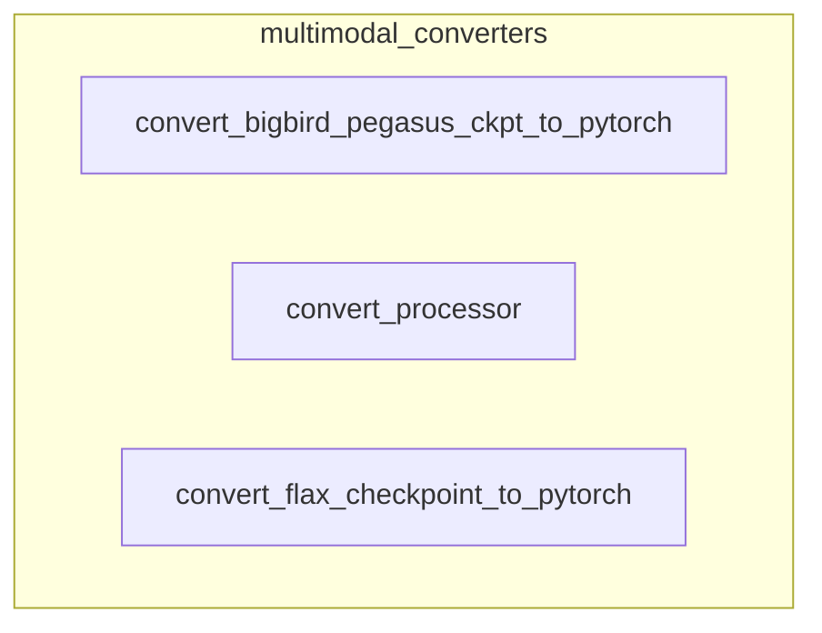

# multimodal_converters
This module provides utilities for converting various model checkpoints and processors from different frameworks (TensorFlow, Flax) or formats into a unified Hugging Face PyTorch format, supporting multimodal models.

<!-- DIAGRAM_JSON
{
    "nodes": [
        {
            "id": "multimodal_converters",
            "label": "multimodal_converters",
            "type": "module"
        },
        {
            "id": "A",
            "label": "convert_bigbird_pegasus_ckpt_to_pytorch"
        },
        {
            "id": "B",
            "label": "convert_processor"
        },
        {
            "id": "C",
            "label": "convert_flax_checkpoint_to_pytorch"
        },
        {
            "id": "tf_model_conversion",
            "label": "TensorFlow Model Conversion",
            "type": "module",
            "link": "tf_model_conversion.md"
        },
        {
            "id": "multimodal_processor_conversion",
            "label": "Multimodal Processor Conversion",
            "type": "module",
            "link": "multimodal_processor_conversion.md"
        },
        {
            "id": "flax_model_conversion",
            "label": "Flax Model Conversion",
            "type": "module",
            "link": "flax_model_conversion.md"
        }
    ],
    "edges": [
        {
            "source": "A",
            "target": "tf_model_conversion"
        },
        {
            "source": "A",
            "target": "multimodal_processor_conversion"
        },
        {
            "source": "A",
            "target": "flax_model_conversion"
        }
    ],
    "groups": [
        {
            "id": "multimodal_converters__group",
            "label": "multimodal_converters",
            "nodes": [
                "A",
                "B",
                "C"
            ],
            "_repaired": "r4_group_renamed_avoid_node_collision"
        }
    ]
}
-->
