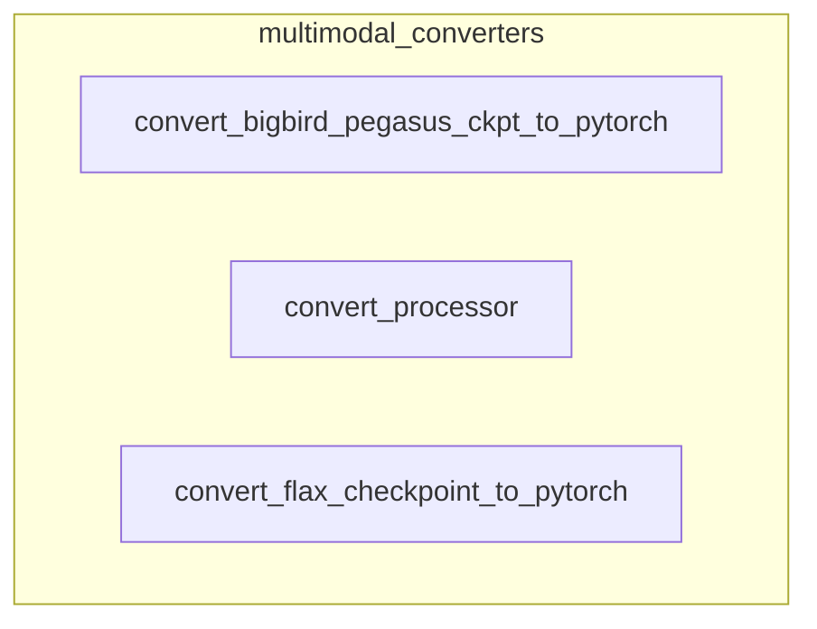

# multimodal_converters
This module provides utilities for converting various model checkpoints and processors from different frameworks (TensorFlow, Flax) or formats into a unified Hugging Face PyTorch format, supporting multimodal models.

<!-- DIAGRAM_JSON
{
  "nodes": [
    {"id": "A", "label": "convert_bigbird_pegasus_ckpt_to_pytorch"},
    {"id": "B", "label": "convert_processor"},
    {"id": "C", "label": "convert_flax_checkpoint_to_pytorch"}
  ],
  "edges": [],
  "groups": [
    {"id": "multimodal_converters", "label": "multimodal_converters", "nodes": ["A", "B", "C"]}
  ]
}
-->
