# multimodal_model_architectures
This module defines various multimodal model architectures, including BLIP, Ernie, GLM4V, Idefics, and InstructBLIP, handling vision and text integration.

<!-- DIAGRAM_JSON
{
  "nodes": [
    {"id": "A", "label": "BlipModel", "properties": {"type": "class", "source": "src.transformers.models.blip.modeling_blip.BlipModel", "description": "Combines text and vision models, projects features."}},
    {"id": "B", "label": "Ernie4_5_VL_MoeTextModel", "properties": {"type": "class", "source": "src.transformers.models.ernie4_5_vl_moe.modeling_ernie4_5_vl_moe.Ernie4_5_VL_MoeTextModel", "description": "Deprecated text model, delegates to parent."}},
    {"id": "C", "label": "Glm4vMoeTextModel", "properties": {"type": "class", "source": "src.transformers.models.glm4v_moe.modeling_glm4v_moe.Glm4vMoeTextModel", "description": "Text model with MoE architecture."}},
    {"id": "D", "label": "IdeficsForVisionText2Text", "properties": {"type": "class", "source": "src.transformers.models.idefics.modeling_idefics.IdeficsForVisionText2Text", "description": "Vision-text-to-text model, combines IdeficsModel with a language model head."}},
    {"id": "E", "label": "InstructBlipModel", "properties": {"type": "class", "source": "src.transformers.models.instructblip.modeling_instructblip.InstructBlipModel", "description": "InstructBLIP model combining vision, Q-Former, and a language model."}},
    {"id": "F", "label": "BlipPreTrainedModel", "properties": {"type": "class", "description": "Parent class for Blip models."}},
    {"id": "G", "label": "BlipTextModel", "properties": {"type": "class", "description": "Text component of BlipModel."}},
    {"id": "H", "label": "BlipVisionModel", "properties": {"type": "class", "description": "Vision component of BlipModel."}},
    {"id": "I", "label": "Ernie4_5_VLMoeTextModel", "properties": {"type": "class", "description": "Parent class for Ernie4_5_VL_MoeTextModel."}},
    {"id": "J", "label": "Glm4vMoePreTrainedModel", "properties": {"type": "class", "description": "Parent class for Glm4vMoeTextModel."}},
    {"id": "K", "label": "Glm4vMoeTextDecoderLayer", "properties": {"type": "class", "description": "Decoder layer for Glm4vMoeTextModel."}},
    {"id": "L", "label": "Glm4vMoeTextAttention", "properties": {"type": "class", "description": "Attention mechanism for Glm4vMoeTextModel."}},
    {"id": "M", "label": "Glm4vMoeTextTopkRouter", "properties": {"type": "class", "description": "Top-k router for Glm4vMoeTextModel."}},
    {"id": "N", "label": "Glm4vMoeTextRotaryEmbedding", "properties": {"type": "class", "description": "Rotary embedding for Glm4vMoeTextModel."}},
    {"id": "O", "label": "IdeficsPreTrainedModel", "properties": {"type": "class", "description": "Parent class for Idefics models."}},
    {"id": "P", "label": "GenerationMixin", "properties": {"type": "mixin", "description": "Mixin for generation capabilities."}},
    {"id": "Q", "label": "IdeficsModel", "properties": {"type": "class", "description": "Core Idefics model."}},
    {"id": "R", "label": "IdeficsDecoupledLinear", "properties": {"type": "class", "description": "Decoupled linear layer for Idefics."}},
    {"id": "S", "label": "InstructBlipPreTrainedModel", "properties": {"type": "class", "description": "Parent class for InstructBlip models."}},
    {"id": "T", "label": "InstructBlipVisionModel", "properties": {"type": "class", "description": "Vision component of InstructBlipModel."}},
    {"id": "U", "label": "InstructBlipQFormerModel", "properties": {"type": "class", "description": "Q-Former component of InstructBlipModel."}},
    {"id": "V", "label": "AutoModel", "properties": {"type": "class", "description": "AutoModel for language component of InstructBlipModel."}}
  ],
  "edges": [
    {"source": "A", "target": "F", "type": "inheritance"},
    {"source": "A", "target": "G", "type": "composition"},
    {"source": "A", "target": "H", "type": "composition"},
    {"source": "B", "target": "I", "type": "inheritance"},
    {"source": "C", "target": "J", "type": "inheritance"},
    {"source": "C", "target": "K", "type": "composition"},
    {"source": "C", "target": "L", "type": "composition"},
    {"source": "C", "target": "M", "type": "composition"},
    {"source": "C", "target": "N", "type": "composition"},
    {"source": "D", "target": "O", "type": "inheritance"},
    {"source": "D", "target": "P", "type": "inheritance"},
    {"source": "D", "target": "Q", "type": "composition"},
    {"source": "D", "target": "R", "type": "composition"},
    {"source": "E", "target": "S", "type": "inheritance"},
    {"source": "E", "target": "T", "type": "composition"},
    {"source": "E", "target": "U", "type": "composition"},
    {"source": "E", "target": "V", "type": "composition"}
  ],
  "groups": [
    {"id": "multimodal_model_architectures", "label": "multimodal_model_architectures", "nodes": ["A", "B", "C", "D", "E"]}
  ]
}
-->

```mermaid
flowchart TD
    subgraph multimodal_model_architectures
        A[BlipModel]
        B[Ernie4_5_VL_MoeTextModel]
        C[Glm4vMoeTextModel]
        D[IdeficsForVisionText2Text]
        E[InstructBlipModel]
    end

    F[BlipPreTrainedModel]
    G[BlipTextModel]
    H[BlipVisionModel]
    I[Ernie4_5_VLMoeTextModel]
    J[Glm4vMoePreTrainedModel]
    K[Glm4vMoeTextDecoderLayer]
    L[Glm4vMoeTextAttention]
    M[Glm4vMoeTextTopkRouter]
    N[Glm4vMoeTextRotaryEmbedding]
    O[IdeficsPreTrainedModel]
    P[GenerationMixin]
    Q[IdeficsModel]
    R[IdeficsDecoupledLinear]
    S[InstructBlipPreTrainedModel]
    T[InstructBlipVisionModel]
    U[InstructBlipQFormerModel]
    V[AutoModel]

    A -->|"inherits"| F
    A --> G
    A --> H

    B -->|"inherits"| I

    C -->|"inherits"| J
    C --> K
    C --> L
    C --> M
    C --> N

    D -->|"inherits"| O
    D -->|"inherits"| P
    D --> Q
    D --> R

    E -->|"inherits"| S
    E --> T
    E --> U
    E --> V
```
