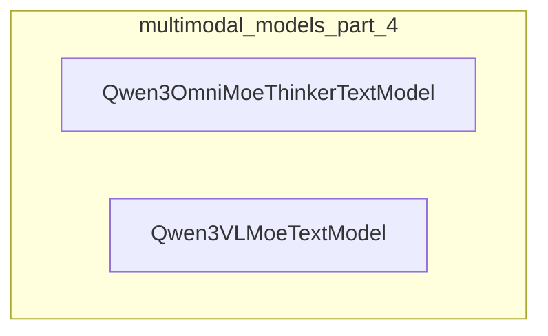

# multimodal_models_part_4
This module defines two Qwen3 text models, `Qwen3OmniMoeThinkerTextModel` and `Qwen3VLMoeTextModel`, designed to process text inputs and integrate visual embeddings for multimodal understanding.

<!-- DIAGRAM_JSON
{
  "nodes": [
    {"id": "Qwen3OmniMoeThinkerTextModel", "label": "Qwen3OmniMoeThinkerTextModel", "type": "component"},
    {"id": "Qwen3VLMoeTextModel", "label": "Qwen3VLMoeTextModel", "type": "component"}
  ],
  "edges": [],
  "groups": [
    {"id": "multimodal_models_part_4", "label": "multimodal_models_part_4", "nodes": ["Qwen3OmniMoeThinkerTextModel", "Qwen3VLMoeTextModel"]}
  ]
}
-->
