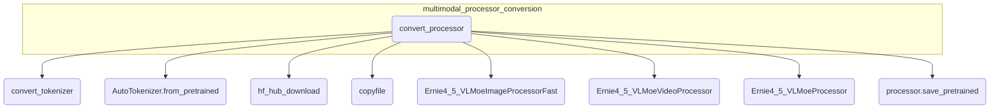

# multimodal_processor_conversion
Converts a pre-trained Ernie 4.5 VL MoE processor, including its tokenizer, image processor, and video processor, to the Hugging Face format, saving all components to a specified directory.

<!-- DIAGRAM_JSON
{
  "nodes": [
    {"id": "multimodal_processor_conversion", "label": "multimodal_processor_conversion", "type": "module"},
    {"id": "convert_processor", "label": "convert_processor", "type": "function"},
    {"id": "convert_tokenizer", "label": "convert_tokenizer", "type": "function_call"},
    {"id": "AutoTokenizer_from_pretrained", "label": "AutoTokenizer.from_pretrained", "type": "function_call"},
    {"id": "hf_hub_download", "label": "hf_hub_download", "type": "function_call"},
    {"id": "copyfile", "label": "copyfile", "type": "function_call"},
    {"id": "Ernie4_5_VLMoeImageProcessorFast", "label": "Ernie4_5_VLMoeImageProcessorFast", "type": "class_instantiation"},
    {"id": "Ernie4_5_VLMoeVideoProcessor", "label": "Ernie4_5_VLMoeVideoProcessor", "type": "class_instantiation"},
    {"id": "Ernie4_5_VLMoeProcessor", "label": "Ernie4_5_VLMoeProcessor", "type": "class_instantiation"},
    {"id": "processor_save_pretrained", "label": "processor.save_pretrained", "type": "method_call"}
  ],
  "edges": [
    {"source": "multimodal_processor_conversion", "target": "convert_processor", "type": "contains"},
    {"source": "convert_processor", "target": "convert_tokenizer", "type": "calls"},
    {"source": "convert_processor", "target": "AutoTokenizer_from_pretrained", "type": "calls"},
    {"source": "convert_processor", "target": "hf_hub_download", "type": "calls"},
    {"source": "convert_processor", "target": "copyfile", "type": "calls"},
    {"source": "convert_processor", "target": "Ernie4_5_VLMoeImageProcessorFast", "type": "calls"},
    {"source": "convert_processor", "target": "Ernie4_5_VLMoeVideoProcessor", "type": "calls"},
    {"source": "convert_processor", "target": "Ernie4_5_VLMoeProcessor", "type": "calls"},
    {"source": "convert_processor", "target": "processor_save_pretrained", "type": "calls"}
  ],
  "groups": [
    {"id": "multimodal_processor_conversion_group", "label": "multimodal_processor_conversion", "nodes": ["convert_processor"]}
  ]
}
-->
