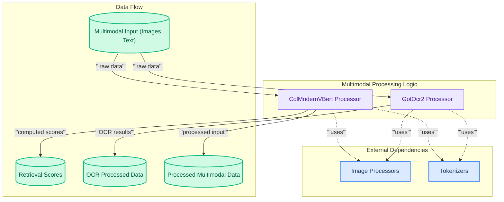

# Multimodal Processors
This module provides specialized processors for multimodal data. It includes `ColModernVBertProcessor` for integrated image and query processing with retrieval scoring, and `GotOcr2Processor` for advanced OCR capabilities on diverse document types.
<!-- DIAGRAM_JSON
{
    "direction": "TD",
    "nodes": [
        {
            "id": "input_data",
            "label": "Multimodal Input (Images, Text)",
            "type": "data",
            "link": null
        },
        {
            "id": "colmodernvbert_proc",
            "label": "ColModernVBert Processor",
            "type": "component",
            "link": null
        },
        {
            "id": "got_ocr2_proc",
            "label": "GotOcr2 Processor",
            "type": "component",
            "link": null
        },
        {
            "id": "img_proc",
            "label": "Image Processors",
            "type": "external",
            "link": "image_processors.md"
        },
        {
            "id": "tokenizer_mod",
            "label": "Tokenizers",
            "type": "external",
            "link": "tokenizers.md"
        },
        {
            "id": "retrieval_scores_out",
            "label": "Retrieval Scores",
            "type": "data",
            "link": null
        },
        {
            "id": "ocr_output_out",
            "label": "OCR Processed Data",
            "type": "data",
            "link": null
        },
        {
            "id": "processed_multimodal_out",
            "label": "Processed Multimodal Data",
            "type": "data",
            "link": null
        }
    ],
    "edges": [
        {
            "source": "input_data",
            "target": "colmodernvbert_proc",
            "label": "raw data"
        },
        {
            "source": "input_data",
            "target": "got_ocr2_proc",
            "label": "raw data"
        },
        {
            "source": "colmodernvbert_proc",
            "target": "img_proc",
            "label": "uses"
        },
        {
            "source": "colmodernvbert_proc",
            "target": "tokenizer_mod",
            "label": "uses"
        },
        {
            "source": "got_ocr2_proc",
            "target": "img_proc",
            "label": "uses"
        },
        {
            "source": "got_ocr2_proc",
            "target": "tokenizer_mod",
            "label": "uses"
        },
        {
            "source": "colmodernvbert_proc",
            "target": "processed_multimodal_out",
            "label": "processed input"
        },
        {
            "source": "colmodernvbert_proc",
            "target": "retrieval_scores_out",
            "label": "computed scores"
        },
        {
            "source": "got_ocr2_proc",
            "target": "ocr_output_out",
            "label": "OCR results"
        }
    ],
    "groups": [
        {
            "id": "processors_group",
            "label": "Multimodal Processing Logic",
            "role": "analytical",
            "nodes": [
                "colmodernvbert_proc",
                "got_ocr2_proc"
            ]
        },
        {
            "id": "external_deps",
            "label": "External Dependencies",
            "role": "surface",
            "nodes": [
                "img_proc",
                "tokenizer_mod"
            ]
        },
        {
            "id": "data_flow_group",
            "label": "Data Flow",
            "role": "data",
            "nodes": [
                "input_data",
                "retrieval_scores_out",
                "ocr_output_out",
                "processed_multimodal_out"
            ]
        }
    ]
}
-->
