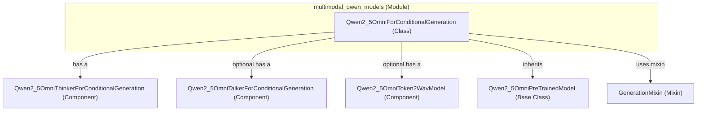

# multimodal_qwen_models
The `multimodal_qwen_models` module provides `Qwen2_5OmniForConditionalGeneration`, a comprehensive model for multimodal conditional generation. It integrates a `thinker` for core generation and optional `talker` and `token2wav` components for audio output.

<!-- DIAGRAM_JSON
{
  "nodes": [
    {
      "id": "multimodal_qwen_models",
      "label": "multimodal_qwen_models",
      "type": "module"
    },
    {
      "id": "Qwen2_5OmniForConditionalGeneration",
      "label": "Qwen2_5OmniForConditionalGeneration",
      "type": "class"
    },
    {
      "id": "Qwen2_5OmniThinkerForConditionalGeneration",
      "label": "Qwen2_5OmniThinkerForConditionalGeneration",
      "type": "component"
    },
    {
      "id": "Qwen2_5OmniTalkerForConditionalGeneration",
      "label": "Qwen2_5OmniTalkerForConditionalGeneration",
      "type": "component"
    },
    {
      "id": "Qwen2_5OmniToken2WavModel",
      "label": "Qwen2_5OmniToken2WavModel",
      "type": "component"
    },
    {
      "id": "Qwen2_5OmniPreTrainedModel",
      "label": "Qwen2_5OmniPreTrainedModel",
      "type": "base_class"
    },
    {
      "id": "GenerationMixin",
      "label": "GenerationMixin",
      "type": "mixin"
    }
  ],
  "edges": [
    {
      "source": "multimodal_qwen_models",
      "target": "Qwen2_5OmniForConditionalGeneration",
      "label": "contains"
    },
    {
      "source": "Qwen2_5OmniForConditionalGeneration",
      "target": "Qwen2_5OmniPreTrainedModel",
      "label": "inherits"
    },
    {
      "source": "Qwen2_5OmniForConditionalGeneration",
      "target": "GenerationMixin",
      "label": "inherits"
    },
    {
      "source": "Qwen2_5OmniForConditionalGeneration",
      "target": "Qwen2_5OmniThinkerForConditionalGeneration",
      "label": "has a"
    },
    {
      "source": "Qwen2_5OmniForConditionalGeneration",
      "target": "Qwen2_5OmniTalkerForConditionalGeneration",
      "label": "optional has a"
    },
    {
      "source": "Qwen2_5OmniForConditionalGeneration",
      "target": "Qwen2_5OmniToken2WavModel",
      "label": "optional has a"
    }
  ],
  "groups": [
    {
      "id": "multimodal_qwen_models_group",
      "label": "multimodal_qwen_models",
      "nodes": [
        "Qwen2_5OmniForConditionalGeneration"
      ]
    }
  ]
}
-->
```
