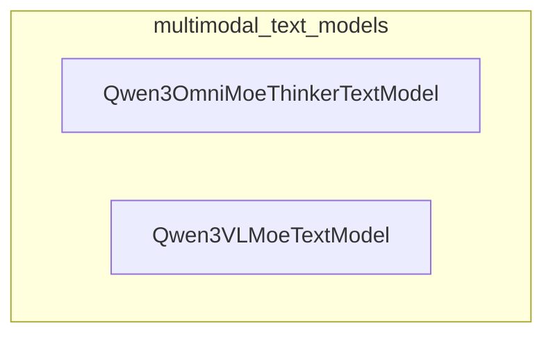

# multimodal_text_models
This module provides two text model components, Qwen3OmniMoeThinkerTextModel and Qwen3VLMoeTextModel, designed for multimodal Mixture-of-Experts architectures.

<!-- DIAGRAM_JSON
{
  "nodes": [
    {
      "id": "Qwen3OmniMoeThinkerTextModel",
      "label": "Qwen3OmniMoeThinkerTextModel",
      "type": "component"
    },
    {
      "id": "Qwen3VLMoeTextModel",
      "label": "Qwen3VLMoeTextModel",
      "type": "component"
    }
  ],
  "edges": [],
  "groups": [
    {
      "id": "multimodal_text_models",
      "label": "multimodal_text_models",
      "nodes": ["Qwen3OmniMoeThinkerTextModel", "Qwen3VLMoeTextModel"]
    }
  ]
}
-->
