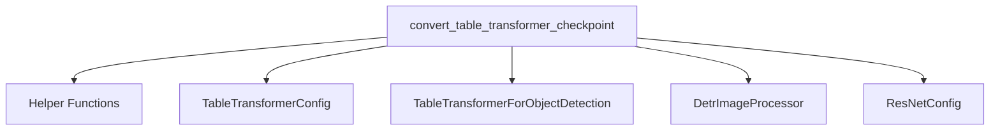

# `no_timm_conversion` Module Documentation

## Introduction

The `no_timm_conversion` module is a specialized utility within the `table_transformer_models` package, designed to facilitate the conversion of pre-trained Table Transformer model checkpoints into a format compatible with the Hugging Face `transformers` library. Crucially, this module handles models whose backbone does *not* rely on the `timm` library, distinguishing it from the `timm_conversion` counterpart. It provides the necessary logic to adapt model weights, configurations, and post-processing components for seamless integration into the Hugging Face ecosystem.

## Purpose and Core Functionality

The primary purpose of this module is to enable the use of non-`timm`-based Table Transformer models within the Hugging Face `transformers` framework. Its core functionality is encapsulated in the `convert_table_transformer_checkpoint` function, which performs the following key operations:

1.  **Configuration Loading**: It initializes `ResNetConfig` for the model's backbone and `TableTransformerConfig` for the overall Table Transformer architecture, explicitly setting `use_timm_backbone=False`.
2.  **Checkpoint Loading**: Downloads and loads the original PyTorch model state dictionary from a given URL.
3.  **Key Renaming and Adaptation**: Transforms the keys of the original state dictionary to match the naming conventions expected by Hugging Face models. This includes specific handling for query, key, and value matrices, and prepending a `model.` prefix to base model keys.
4.  **Model Initialization**: Instantiates a `TableTransformerForObjectDetection` model based on the adapted configuration, dynamically adjusting parameters like `num_queries` and `num_labels` based on whether the checkpoint is for table detection or structure recognition.
5.  **Image Processor Setup**: Initializes a `DetrImageProcessor` configured for COCO detection.
6.  **Weight Loading**: Loads the meticulously renamed weights into the newly created Hugging Face model.
7.  **Verification**: Conducts a basic functional test by loading an example image, processing it, and performing a forward pass, asserting the output shapes and values against expected results to confirm a successful conversion.
8.  **Saving and Pushing**: Optionally saves the converted model and its associated image processor to a specified local folder and/or pushes them to the Hugging Face Model Hub, making them readily available for community use.

This module ensures that Table Transformer models, even those without `timm` backbones, can benefit from the extensive features and community support of the Hugging Face ecosystem.

## Architecture and Component Relationships

The `no_timm_conversion` module centers around its `convert_table_transformer_checkpoint` function, which orchestrates the conversion process by interacting with several internal helper functions and external modules.

### Internal Components

*   `convert_table_transformer_checkpoint`: The main entry point for the conversion process. It coordinates all steps from loading the original checkpoint to saving the Hugging Face model.
*   `Helper Functions` (e.g., `create_rename_keys`, `rename_key`, `read_in_q_k_v`, `normalize`, `resize`): These are utility functions that assist `convert_table_transformer_checkpoint` by performing specific tasks such as adjusting state dictionary keys, handling attention layer transformations, and pre-processing images for verification.

### External Dependencies

*   [`table_transformer_models`](table_transformer_models.md): The overarching module providing the `TableTransformerConfig` and `TableTransformerForObjectDetection` model architecture, which this conversion utility targets.
*   [`detr_models`](detr_models.md): Provides the `DetrImageProcessor` used for image preprocessing, as Table Transformer builds upon DETR principles.
*   [`modeling_utilities`](modeling_utilities.md): Contains general modeling utilities, including `ResNetConfig`, which defines the backbone architecture for the Table Transformer.

## Overall System Fit

This module is a critical piece of the `transformers` library's interoperability strategy, specifically for the `table_transformer_models`. It serves as a bridge, allowing pre-trained Table Transformer models that do not rely on the `timm` library for their backbone implementation to be integrated and utilized within the Hugging Face framework. By providing a reliable conversion path, it expands the range of readily available models and contributes to a more unified and accessible ecosystem for researchers and developers. It complements the `timm_conversion` module by offering an alternative conversion path for models with different backbone implementations, ensuring broader compatibility.

<!-- DIAGRAM_JSON
{
    "direction": "TD",
    "nodes": [
        {"id": "convert_checkpoint", "label": "convert_table_transformer_checkpoint", "type": "component", "link": null},
        {"id": "helpers", "label": "Helper Functions", "type": "component", "link": null},
        {"id": "table_transformer_config", "label": "TableTransformerConfig", "type": "external", "link": "table_transformer_models.md"},
        {"id": "table_transformer_model", "label": "TableTransformerForObjectDetection", "type": "external", "link": "table_transformer_models.md"},
        {"id": "detr_image_processor", "label": "DetrImageProcessor", "type": "external", "link": "detr_models.md"},
        {"id": "resnet_config", "label": "ResNetConfig", "type": "external", "link": "modeling_utilities.md"}
    ],
    "edges": [
        {"source": "convert_checkpoint", "target": "helpers"},
        {"source": "convert_checkpoint", "target": "table_transformer_config"},
        {"source": "convert_checkpoint", "target": "table_transformer_model"},
        {"source": "convert_checkpoint", "target": "detr_image_processor"},
        {"source": "convert_checkpoint", "target": "resnet_config"}
    ],
    "groups": []
}
-->

