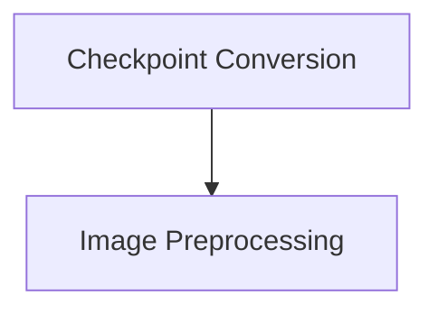

# Nougat Models Documentation

The `nougat_models` module encompasses the core components for integrating and utilizing Nougat (Neural Optical Understanding for Academic Documents) models within the system. It primarily deals with converting pre-trained Nougat checkpoints to a compatible Hugging Face format and robust image preprocessing utilities essential for the model's inference.

## Architecture

The `nougat_models` module is composed of two main sub-modules:

<!-- DIAGRAM_JSON
{
    "direction": "TD",
    "nodes": [
        {"id": "conversion_utility", "label": "Checkpoint Conversion", "type": "module", "link": "conversion_utility.md"},
        {"id": "image_processing", "label": "Image Preprocessing", "type": "module", "link": "image_processing.md"}
    ],
    "edges": [
        {"source": "conversion_utility", "target": "image_processing"}
    ],
    "groups": []
}
-->

## Sub-modules

### [Checkpoint Conversion](conversion_utility.md)
This sub-module is responsible for converting original Nougat model checkpoints to a format compatible with Hugging Face's `transformers` library. It also includes rigorous verification steps to ensure the fidelity of the converted model.

### [Image Preprocessing](image_processing.md)
This sub-module provides a specialized image processor, `NougatImageProcessorPil`, designed for Nougat models. It includes functionalities like cropping margins, aligning long axes, thumbnailing, and padding images to prepare them for model input.
