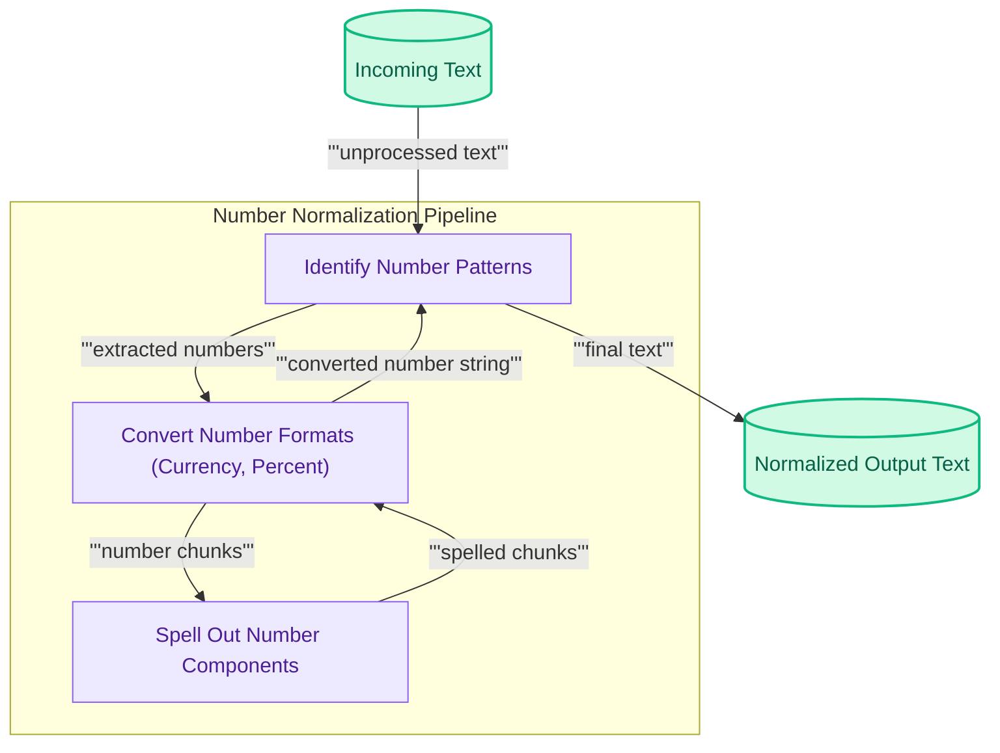

количество нормализации.md
# Number Normalization
This module identifies and converts numerical expressions in text (e.g., currencies, percentages) into their spoken English word equivalents, ensuring consistent representation for NLP applications.

<!-- DIAGRAM_JSON
{
    "direction": "TD",
    "nodes": [
        {"id": "raw_text", "label": "Incoming Text", "type": "data", "link": null},
        {"id": "identify_numbers", "label": "Identify Number Patterns", "type": "component", "link": null},
        {"id": "convert_format", "label": "Convert Number Formats (Currency, Percent)", "type": "component", "link": null},
        {"id": "spell_parts", "label": "Spell Out Number Components", "type": "component", "link": null},
        {"id": "normalized_text", "label": "Normalized Output Text", "type": "data", "link": null}
    ],
    "edges": [
        {"source": "raw_text", "target": "identify_numbers", "label": "unprocessed text"},
        {"source": "identify_numbers", "target": "convert_format", "label": "extracted numbers"},
        {"source": "convert_format", "target": "spell_parts", "label": "number chunks"},
        {"source": "spell_parts", "target": "convert_format", "label": "spelled chunks"},
        {"source": "convert_format", "target": "identify_numbers", "label": "converted number string"},
        {"source": "identify_numbers", "target": "normalized_text", "label": "final text"}
    ],
    "groups": [
        {"id": "normalization_pipeline", "label": "Number Normalization Pipeline", "role": "analytical", "nodes": ["identify_numbers", "convert_format", "spell_parts"]}
    ]
}
-->

