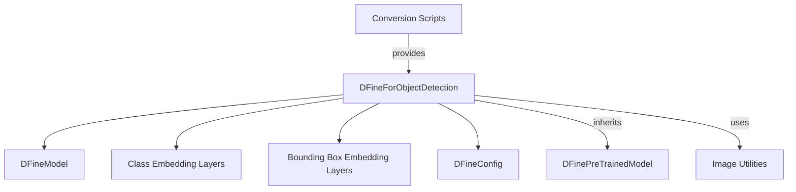

# object_detection_model

The `object_detection_model` module, within the context of `lw_detr_models`, provides the core functionality for object detection using the LwDetr architecture. This module encapsulates the `LwDetrForObjectDetection` class, which is responsible for processing images, predicting bounding boxes, and classifying objects within them.

## Architecture and Component Relationships

The `LwDetrForObjectDetection` class builds upon the foundational `LwDetrModel` and leverages specialized prediction heads for object classification and bounding box regression. It integrates with configuration settings provided by `LwDetrConfig` and interacts with external image processing utilities for end-to-end object detection pipelines.

<!-- DIAGRAM_JSON
{
    "direction": "TD",
    "nodes": [
        {"id": "lw_detr_object_detection_model", "label": "LwDetrForObjectDetection", "type": "component", "link": null},
        {"id": "lw_detr_model_internal", "label": "LwDetrModel (internal)", "type": "component", "link": null},
        {"id": "lw_detr_mlp_head_internal", "label": "LwDetrMLPPredictionHead (internal)", "type": "component", "link": null},
        {"id": "lw_detr_config", "label": "LwDetrConfig", "type": "external", "link": "lw_detr_models.md"},
        {"id": "image_processor", "label": "Image Processing Utilities", "type": "external", "link": "image_utilities.md"},
        {"id": "lw_detr_models", "label": "lw_detr_models", "type": "external", "link": "lw_detr_models.md"}
    ],
    "edges": [
        {"source": "lw_detr_object_detection_model", "target": "lw_detr_model_internal"},
        {"source": "lw_detr_object_detection_model", "target": "lw_detr_mlp_head_internal"},
        {"source": "lw_detr_object_detection_model", "target": "lw_detr_config"},
        {"source": "lw_detr_models", "target": "lw_detr_object_detection_model", "label": "contains"}
    ],
    "groups": []
}
-->

```mermaid
graph TD
    lw_detr_object_detection_model[LwDetrForObjectDetection]
    lw_detr_model_internal[LwDetrModel (internal)]
    lw_detr_mlp_head_internal[LwDetrMLPPredictionHead (internal)]
    lw_detr_config[LwDetrConfig]:::external
    image_processor[Image Processing Utilities]:::external
    lw_detr_models[lw_detr_models]:::external

    lw_detr_object_detection_model --> lw_detr_model_internal
    lw_detr_object_detection_model --> lw_detr_mlp_head_internal
    lw_detr_object_detection_model --> lw_detr_config
    lw_detr_models --> lw_detr_object_detection_model
    classDef external fill:#f9f,stroke:#333,stroke-width:2px;
```

## `LwDetrForObjectDetection` Class

The `LwDetrForObjectDetection` class is a PyTorch module designed for end-to-end object detection. It takes raw pixel values as input and outputs predicted bounding boxes and class logits.

- **Purpose**: Performs object detection by integrating a LwDetr transformer model with specialized heads for classification and bounding box regression.
- **Inheritance**: Inherits from `LwDetrPreTrainedModel`.

### Initialization (`__init__`)

The constructor initializes the core components of the object detection model:

- `config` (`LwDetrConfig`): The configuration object containing model hyperparameters and architecture details.
- `self.model`: An instance of `LwDetrModel`, which forms the backbone of the LwDetr architecture.
- `self.class_embed`: A linear layer (`nn.Linear`) used to predict class logits for detected objects.
- `self.bbox_embed`: An instance of `LwDetrMLPPredictionHead`, a multi-layer perceptron (MLP) responsible for regressing bounding box coordinates.

### Forward Method (`forward`)

```python
def forward(
    self,
    pixel_values: torch.FloatTensor = None,
    pixel_mask: torch.LongTensor | None = None,
    labels: list[dict] | None = None,
    **kwargs: Unpack[TransformersKwargs],
) -> LwDetrObjectDetectionOutput:
```

The `forward` method processes input images to perform object detection.

- **`pixel_values`** (`torch.FloatTensor`): The input image pixels, typically preprocessed.
- **`pixel_mask`** (`torch.LongTensor`, *optional*): An attention mask indicating which pixels are valid.
- **`labels`** (`list[Dict]`, *optional*): A list of dictionaries, where each dictionary contains ground truth `class_labels` and `boxes` for an image in the batch. These are used for calculating the loss during training.
- **`**kwargs`**: Additional keyword arguments.

The method returns an instance of `LwDetrObjectDetectionOutput`, containing:
- `loss` (`torch.FloatTensor`, *optional*): The total loss if `labels` are provided.
- `loss_dict` (`Dict`, *optional`): A dictionary of individual loss components.
- `logits` (`torch.FloatTensor`): Predicted class logits.
- `pred_boxes` (`torch.FloatTensor`): Predicted bounding box coordinates.
- `auxiliary_outputs` (`list[LwDetrObjectDetectionOutput]`, *optional*): Auxiliary outputs from intermediate decoder layers if `auxiliary_loss` is enabled.
- Other outputs from the base model like `last_hidden_state`, `intermediate_hidden_states`, `attentions`, etc.

### Usage Example

```python
>>> from transformers import AutoImageProcessor, LwDetrForObjectDetection
>>> from PIL import Image
>>> import httpx
>>> from io import BytesIO

>>> url = "http://images.cocodataset.org/val2017/000000039769.jpg"
>>> with httpx.stream("GET", url) as response:
...     image = Image.open(BytesIO(response.read()))

>>> image_processor = AutoImageProcessor.from_pretrained("AnnaZhang/lwdetr_small_60e_coco")
>>> model = LwDetrForObjectDetection.from_pretrained("AnnaZhang/lwdetr_small_60e_coco")

>>> inputs = image_processor(images=image, return_tensors="pt")
>>> outputs = model(**inputs)

>>> # convert outputs (bounding boxes and class logits) to Pascal VOC format (xmin, ymin, xmax, ymax)
>>> target_sizes = torch.tensor([image.size[::-1]])
>>> results = image_processor.post_process_object_detection(outputs, threshold=0.5, target_sizes=target_sizes)[
...     0
... ]
>>> for score, label, box in zip(results["scores"], results["labels"], results["boxes"]):
...     box = [round(i, 2) for i in box.tolist()]
...     print(
...         f"Detected {model.config.id2label[label.item()]} with confidence "
...         f"{round(score.item(), 3)} at location {box}"
...     )
Detected cat with confidence 0.8 at location [16.5, 52.84, 318.25, 470.78]
Detected cat with confidence 0.789 at location [342.19, 24.3, 640.02, 372.25]
Detected remote with confidence 0.633 at location [40.79, 72.78, 176.76, 117.25]
```

## How the Module Fits into the Overall System

The `object_detection_model` module, specifically `LwDetrForObjectDetection`, is a crucial component within the `lw_detr_models` ecosystem, providing the primary inference and training capabilities for object detection tasks. It depends on the `lw_detr_models` for its underlying transformer architecture and configuration, and on `image_utilities` for image preprocessing and postprocessing. This module is designed to be easily integrated into broader computer vision pipelines requiring accurate and efficient object localization and classification.

### Purpose and Core Functionality

The primary purpose of this module is to offer a robust and efficient object detection solution based on the D-FINE model. Its core functionality revolves around:

*   **End-to-end Object Detection:** Taking raw image data, processing it through an encoder-decoder network, and directly outputting predicted bounding boxes and corresponding class probabilities.
*   **Auxiliary Loss Support:** Incorporating auxiliary losses during training to enhance model stability and performance.
*   **Flexible Configuration:** Utilizing a `DFineConfig` object to allow for various architectural configurations and hyperparameter adjustments.

### Architecture and Component Relationships

The `object_detection_model` module is centered around the `DFineForObjectDetection` class and its internal components, along with its external dependencies.

**Internal Components:**

*   **`DFineForObjectDetection`**: This is the main class within the module. It orchestrates the entire object detection process, from receiving input images to producing final predictions. It inherits from `DFinePreTrainedModel` and contains instances of `DFineModel`, `class_embed`, and `bbox_embed`.
*   **`class_embed` (Class Embedding Layers)**: An `nn.ModuleList` of linear layers responsible for predicting the class logits for each detected object.
*   **`bbox_embed` (Bounding Box Embedding Layers)**: An `nn.ModuleList` of `DFineMLP` modules that predict the bounding box coordinates (e.g., center, width, height) for each object.

**External Dependencies:**

*   **`d_fine_models`**: This module provides foundational D-FINE components:
    *   **`DFinePreTrainedModel`**: The base class from which `DFineForObjectDetection` inherits, providing common functionalities for D-FINE models.
    *   **`DFineModel`**: The core encoder-decoder architecture of the D-FINE model, which `DFineForObjectDetection` utilizes for feature extraction and initial prediction.
    *   **`DFineConfig`**: A configuration class that defines the architectural parameters and hyperparameters for the D-FINE model.
*   **`image_utilities`**: The module interacts with [image_utilities](image_utilities.md) for image preprocessing (e.g., resizing, normalization) before feeding them to the model, and for post-processing the model's raw outputs (e.g., converting normalized bounding boxes to pixel coordinates).
*   **`conversion_scripts`**: This sub-module within `d_fine_models` contains utilities ([conversion_scripts](conversion_scripts.md)) for converting D-FINE models from their original checkpoint formats to the Hugging Face format, making them compatible with `DFineForObjectDetection`.

### System Integration

The `object_detection_model` module serves as a specialized model implementation within the broader `d_fine_models` family. It seamlessly integrates into a machine learning pipeline where object detection is required.

It leverages shared D-FINE components for its underlying structure and configuration, ensuring consistency and reusability across D-FINE-based models. Furthermore, its dependency on the `image_utilities` module highlights a standard practice of separating data preparation and model inference concerns. This separation allows for flexible image handling and consistent output interpretation, making the `DFineForObjectDetection` model easy to incorporate into various vision-related applications.

The presence of `conversion_scripts` indicates that the module supports loading models from various pre-trained sources, facilitating the use of existing D-FINE checkpoints within the Hugging Face ecosystem.

<!-- DIAGRAM_JSON
{
    "direction": "TD",
    "nodes": [
        {"id": "dfine_for_object_detection", "label": "DFineForObjectDetection", "type": "component", "link": null},
        {"id": "class_embed", "label": "Class Embedding Layers", "type": "component", "link": null},
        {"id": "bbox_embed", "label": "Bounding Box Embedding Layers", "type": "component", "link": null},
        {"id": "dfine_model", "label": "DFineModel", "type": "external", "link": "d_fine_models.md"},
        {"id": "dfine_config", "label": "DFineConfig", "type": "external", "link": "d_fine_models.md"},
        {"id": "dfine_pretrained_model", "label": "DFinePreTrainedModel", "type": "external", "link": "d_fine_models.md"},
        {"id": "image_utilities", "label": "Image Utilities", "type": "external", "link": "image_utilities.md"},
        {"id": "conversion_scripts", "label": "Conversion Scripts", "type": "external", "link": "conversion_scripts.md"}
    ],
    "edges": [
        {"source": "dfine_for_object_detection", "target": "dfine_model"},
        {"source": "dfine_for_object_detection", "target": "class_embed"},
        {"source": "dfine_for_object_detection", "target": "bbox_embed"},
        {"source": "dfine_for_object_detection", "target": "dfine_config"},
        {"source": "dfine_for_object_detection", "target": "dfine_pretrained_model", "label": "inherits"},
        {"source": "dfine_for_object_detection", "target": "image_utilities", "label": "uses"},
        {"source": "conversion_scripts", "target": "dfine_for_object_detection", "label": "provides"}
    ],
    "groups": []
}
-->
