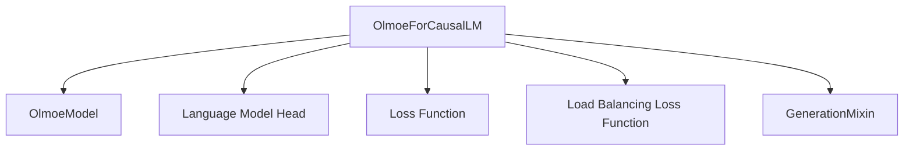

# olmoe_models Module Documentation

## Introduction

The `olmoe_models` module provides the implementation for the Olmoe (Open Language Model in a Mixture-of-Experts) causal language model. This module focuses on enabling efficient and scalable language generation through a Mixture-of-Experts (MoE) architecture, specifically designed for causal language modeling tasks. It includes the core model architecture and the necessary components for tasks such as text generation and masked language modeling.

## Architecture and Component Relationships

The `olmoe_models` module primarily revolves around the `OlmoeForCausalLM` class, which integrates the core `OlmoeModel` with a language modeling head and handles the MoE-specific loss calculations.

<!-- DIAGRAM_JSON
{
    "direction": "TD",
    "nodes": [
        {"id": "olmoe_for_causal_lm", "label": "OlmoeForCausalLM", "type": "component", "link": null},
        {"id": "olmoe_model", "label": "OlmoeModel", "type": "component", "link": null},
        {"id": "lm_head", "label": "Language Model Head", "type": "component", "link": null},
        {"id": "loss_function", "label": "Loss Function", "type": "component", "link": null},
        {"id": "load_balancing_loss_func", "label": "Load Balancing Loss Function", "type": "component", "link": null},
        {"id": "generation_mixins", "label": "GenerationMixin", "type": "external", "link": "generation_mixins.md"}
    ],
    "edges": [
        {"source": "olmoe_for_causal_lm", "target": "olmoe_model"},
        {"source": "olmoe_for_causal_lm", "target": "lm_head"},
        {"source": "olmoe_for_causal_lm", "target": "loss_function"},
        {"source": "olmoe_for_causal_lm", "target": "load_balancing_loss_func"},
        {"source": "olmoe_for_causal_lm", "target": "generation_mixins"}
    ],
    "groups": []
}
-->

### `OlmoeForCausalLM`

**Purpose:** `OlmoeForCausalLM` is the primary class for the Olmoe causal language model. It extends the base `OlmoePreTrainedModel` and incorporates the `GenerationMixin` to provide full causal language modeling capabilities, including text generation and loss computation with support for Mixture-of-Experts (MoE) specific load balancing.

**Core Functionality:**

- **Model Initialization:** Initializes the core `OlmoeModel`, a linear layer (`lm_head`) for projecting hidden states to the vocabulary size, and configures MoE-specific parameters such as `router_aux_loss_coef`, `num_experts`, and `num_experts_per_tok`.
- **Forward Pass:** Processes input IDs, attention masks, and other parameters through the `OlmoeModel`. It then computes logits using the `lm_head`. If labels are provided, it calculates the language modeling loss. Additionally, it computes an auxiliary load balancing loss for the MoE router, which can be optionally added to the main loss to encourage balanced expert usage.
- **Text Generation:** Leverages the `GenerationMixin` to support various text generation strategies, allowing users to generate sequences of tokens based on a given prompt.
- **MoE Loss Calculation:** Incorporates `load_balancing_loss_func` to compute a load balancing loss for the router logits, which is crucial for training MoE models effectively.

**Parameters of `forward` method:**

- `input_ids` (`torch.LongTensor`, *optional*): Input token IDs.
- `attention_mask` (`torch.Tensor`, *optional*): Mask to avoid performing attention on padding token indices.
- `position_ids` (`torch.LongTensor`, *optional*): Positional embeddings for the input sequence.
- `past_key_values` (`Cache`, *optional*): Cached key and value states for efficient decoding.
- `inputs_embeds` (`torch.FloatTensor`, *optional*): Optionally, you can directly pass embedded inputs instead of `input_ids`.
- `labels` (`torch.LongTensor`, *optional*): Labels for computing the masked language modeling loss.
- `use_cache` (`bool`, *optional*): Whether or not to use the past key/values instead of re-computing them.
- `output_router_logits` (`bool`, *optional*): Whether or not to return the router logits.
- `logits_to_keep` (`int` or `torch.Tensor`, *optional*): Number of logits to keep, or indices to slice the logits.

**Returns:**

- `MoeCausalLMOutputWithPast`: A dataclass containing the computed `loss`, `aux_loss`, `logits`, `past_key_values`, `hidden_states`, `attentions`, and `router_logits`.

## How the Module Fits into the Overall System

The `olmoe_models` module is a core component within a larger Transformers-based ecosystem, specifically designed to introduce Mixture-of-Experts capabilities for causal language modeling. It provides a drop-in replacement or an alternative to standard causal language models, offering potential benefits in terms of model capacity and computational efficiency for very large language models.

It depends on the [generation_mixins](generation_mixins.md) module for standard text generation functionalities, ensuring compatibility and ease of use within the existing Hugging Face Transformers framework. The modular design allows for easy integration into various downstream tasks requiring causal language understanding and generation, while leveraging the specialized MoE architecture for improved performance and scalability. This module is essential for applications that require highly performant and resource-efficient language models with a focus on sparse activation patterns enabled by MoE designs.