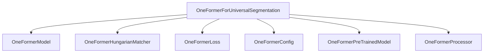

# `oneformer_models`

## Introduction

The `oneformer_models` module provides the `OneFormerForUniversalSegmentation` model, a powerful architecture designed for universal image segmentation tasks. This includes semantic, instance, and panoptic segmentation, all handled within a unified framework. The model leverages a transformer-based encoder-decoder structure and integrates components for efficient mask prediction and loss calculation.

## Architecture and Core Components

The `oneformer_models` module's primary component is `OneFormerForUniversalSegmentation`. This class orchestrates various sub-components from the broader `oneformer` ecosystem to perform its segmentation tasks. It builds upon a `OneFormerModel` for feature extraction and transformation, employs a `OneFormerHungarianMatcher` for optimal bipartite matching between predictions and ground truth, and utilizes a `OneFormerLoss` function to compute the segmentation losses.

### `OneFormerForUniversalSegmentation`

-   **Purpose**: Implements the OneFormer model for universal segmentation, capable of performing semantic, instance, and panoptic segmentation. It encapsulates the complete forward pass, loss calculation, and handles auxiliary predictions.
-   **Key Functionality**:
    -   Initializes with a `OneFormerConfig` to set up model parameters, including class weights, mask weights, and dice weights for loss computation.
    -   Integrates `OneFormerModel`, `OneFormerHungarianMatcher`, and `OneFormerLoss` to form a complete segmentation pipeline.
    -   The `forward` method processes pixel values, task inputs (e.g., specifying "semantic", "instance", or "panoptic" tasks), and optionally ground truth masks and class labels for training.
    -   Calculates and aggregates various losses (cross-entropy, mask, dice, contrastive) during training.
    -   Provides example usage for semantic, instance, and panoptic segmentation inference.

### Relationships with Other Modules

The `oneformer_models` module relies heavily on other components within the `oneformer` family, specifically for its core model, loss computation, and preprocessing/postprocessing:

-   **`oneformer_model`**: Provides the backbone and transformer encoder-decoder architecture. (Refer to [oneformer.md](oneformer.md) for more details)
-   **`oneformer_hungarian_matcher`**: Used for matching predicted segments with ground truth. (Refer to [oneformer.md](oneformer.md) for more details)
-   **`oneformer_loss`**: Calculates the combined loss for segmentation tasks. (Refer to [oneformer.md](oneformer.md) for more details)
-   **`oneformer_config`**: Defines the configuration parameters for the OneFormer model. (Refer to [oneformer.md](oneformer.md) for more details)
-   **`oneformer_pretrained_model`**: The base class providing common functionalities for OneFormer models. (Refer to [oneformer.md](oneformer.md) for more details)
-   **`oneformer_processor`**: Handles image preprocessing and post-processing of model outputs for various segmentation tasks (e.g., `post_process_semantic_segmentation`). (Refer to [oneformer.md](oneformer.md) for more details)

## Diagram

<!-- DIAGRAM_JSON
{
    "direction": "TD",
    "nodes": [
        {"id": "oneformer_for_universal_segmentation", "label": "OneFormerForUniversalSegmentation", "type": "component", "link": null},
        {"id": "oneformer_model", "label": "OneFormerModel", "type": "external", "link": "oneformer.md"},
        {"id": "oneformer_hungarian_matcher", "label": "OneFormerHungarianMatcher", "type": "external", "link": "oneformer.md"},
        {"id": "oneformer_loss", "label": "OneFormerLoss", "type": "external", "link": "oneformer.md"},
        {"id": "oneformer_config", "label": "OneFormerConfig", "type": "external", "link": "oneformer.md"},
        {"id": "oneformer_pretrained_model", "label": "OneFormerPreTrainedModel", "type": "external", "link": "oneformer.md"},
        {"id": "oneformer_processor", "label": "OneFormerProcessor", "type": "external", "link": "oneformer.md"}
    ],
    "edges": [
        {"source": "oneformer_for_universal_segmentation", "target": "oneformer_model"},
        {"source": "oneformer_for_universal_segmentation", "target": "oneformer_hungarian_matcher"},
        {"source": "oneformer_for_universal_segmentation", "target": "oneformer_loss"},
        {"source": "oneformer_for_universal_segmentation", "target": "oneformer_config"},
        {"source": "oneformer_for_universal_segmentation", "target": "oneformer_pretrained_model"},
        {"source": "oneformer_for_universal_segmentation", "target": "oneformer_processor"}
    ],
    "groups": []
}
-->
