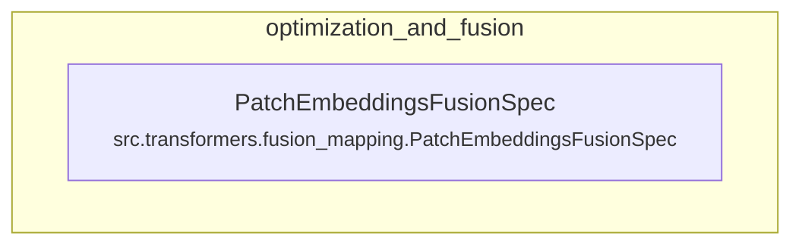

# optimization_and_fusion
The `optimization_and_fusion` module defines specifications for fusing `Conv3d` patch embeddings into `Linear` projections, enhancing model efficiency. It provides the logic to identify fusable modules and transform their weights.

<!-- DIAGRAM_JSON
{
    "nodes": [
        {
            "id": "PatchEmbeddingsFusionSpec",
            "label": "PatchEmbeddingsFusionSpec",
            "path": "src.transformers.fusion_mapping.PatchEmbeddingsFusionSpec"
        }
    ],
    "edges": [],
    "groups": [
        {
            "id": "optimization_and_fusion",
            "label": "optimization_and_fusion",
            "nodes": [
                "PatchEmbeddingsFusionSpec"
            ]
        }
    ]
}
-->
