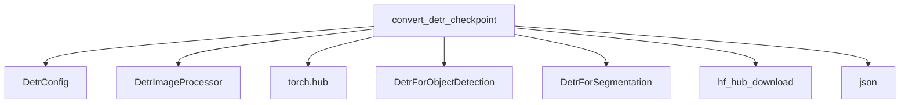

# original_pytorch_conversion Module Documentation

## Introduction

The `original_pytorch_conversion` module is a crucial component within the `detr_models` family, specifically designed for facilitating the conversion of pre-trained DETR models from their original PyTorch implementation (as hosted on `torch.hub`) into the Hugging Face Transformers format. This module supports both object detection and panoptic segmentation variants of DETR, ensuring seamless integration and compatibility with the Hugging Face ecosystem.

Its primary role is to bridge the gap between models trained with external PyTorch codebases and the standardized structure of Hugging Face Transformers, allowing developers to easily load, use, and further fine-tune these models within a unified framework.

## Core Functionality

The core functionality of this module is encapsulated in the `convert_detr_checkpoint` function. This function performs a comprehensive conversion process, including:

### `convert_detr_checkpoint(model_name, pytorch_dump_folder_path)`

This function is responsible for taking an original DETR model checkpoint and transforming it into a Hugging Face compatible format. The key steps involved are:

1.  **Configuration Loading**: It initializes a `DetrConfig` based on the `model_name`. It dynamically sets the backbone (e.g., `resnet101`) and dilation properties. For panoptic segmentation models, it sets `num_labels` to 250; otherwise, it sets it to 91 and loads COCO object detection labels from the Hugging Face Hub.
2.  **Image Processor Preparation**: An instance of `DetrImageProcessor` is created, configured for either COCO panoptic or detection format, preparing it to handle image inputs consistently.
3.  **Original Model Loading**: The pre-trained DETR model is loaded directly from `torch.hub` using the provided `model_name`.
4.  **State Dictionary Renaming**: The loaded model's state dictionary keys are meticulously renamed to align with the naming conventions used in Hugging Face's `DetrForObjectDetection` or `DetrForSegmentation` classes. This involves several specific renaming rules, including special handling for query, key, and value projection matrices within the attention layers.
5.  **Model Instantiation and Weight Loading**: A Hugging Face `DetrForObjectDetection` or `DetrForSegmentation` model (depending on whether it's a panoptic model) is instantiated with the prepared configuration, and the converted state dictionary is loaded into it.
6.  **Conversion Verification**: A critical step where the outputs of the original PyTorch model and the newly converted Hugging Face model are compared using sample inputs to ensure that the conversion maintained numerical fidelity. This includes checking `logits`, `pred_boxes`, and `pred_masks` (for panoptic models).
7.  **Saving Converted Model**: Finally, the converted Hugging Face model and the associated `DetrImageProcessor` are saved to the specified `pytorch_dump_folder_path` for future use.

## Architecture and Component Relationships

This module primarily interacts with external libraries like `torch.hub` for loading original models and relies on other modules within the Hugging Face Transformers library for configuration, image processing, and model definitions.

<!-- DIAGRAM_JSON
{
    "direction": "TD",
    "nodes": [
        {"id": "convert_detr_checkpoint", "label": "convert_detr_checkpoint", "type": "component", "link": null},
        {"id": "detr_config", "label": "DetrConfig", "type": "external", "link": "detr_models.md"},
        {"id": "detr_image_processor", "label": "DetrImageProcessor", "type": "external", "link": "detr_models.md"},
        {"id": "torch_hub", "label": "torch.hub", "type": "external", "link": null},
        {"id": "detr_for_object_detection", "label": "DetrForObjectDetection", "type": "external", "link": "detr_models.md"},
        {"id": "detr_for_segmentation", "label": "DetrForSegmentation", "type": "external", "link": "detr_models.md"},
        {"id": "hf_hub_download", "label": "hf_hub_download", "type": "external", "link": null},
        {"id": "json_lib", "label": "json", "type": "external", "link": null}
    ],
    "edges": [
        {"source": "convert_detr_checkpoint", "target": "detr_config"},
        {"source": "convert_detr_checkpoint", "target": "detr_image_processor"},
        {"source": "convert_detr_checkpoint", "target": "torch_hub"},
        {"source": "convert_detr_checkpoint", "target": "detr_for_object_detection"},
        {"source": "convert_detr_checkpoint", "target": "detr_for_segmentation"},
        {"source": "convert_detr_checkpoint", "target": "hf_hub_download"},
        {"source": "convert_detr_checkpoint", "target": "json_lib"}
    ],
    "groups": []
}
-->

## Integration with the Overall System

This `original_pytorch_conversion` module is a sub-module of `detr_models.model_conversion.detr_conversion_utilities`. It specifically handles the conversion of DETR models from their *original* PyTorch implementations. This is distinct from other potential conversion utilities that might handle different source formats or different versions of the model. It plays a vital role in expanding the range of readily available DETR models within the Hugging Face ecosystem, allowing users to leverage models initially released by the original authors directly.

For more general information on DETR models, their configurations, image processing, and specific model classes like `DetrForObjectDetection` and `DetrForSegmentation`, please refer to the [detr_models documentation](detr_models.md).