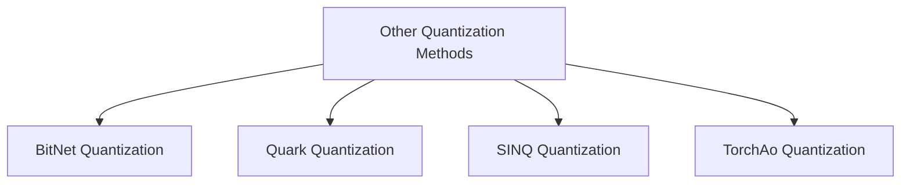

# Other Quantization Methods

## Introduction
This module consolidates various quantization methods beyond standard floating-point-based approaches, offering a diverse set of techniques to reduce model size and accelerate inference. It includes specialized quantizers like BitNet, Quark, SINQ, and TorchAo, each providing unique benefits for different model architectures and deployment scenarios.

## Architecture Overview
The `other_quantization_methods` module acts as a container for distinct quantization implementations. Each quantization method is encapsulated within its own sub-module, inheriting from `HfQuantizer` and providing specific logic for environment validation, model processing before and after weight loading, and weight conversions.

<!-- DIAGRAM_JSON
{
    "direction": "TD",
    "nodes": [
        {"id": "other_quantization_methods", "label": "Other Quantization Methods", "type": "module"},
        {"id": "bitnet_quantizer", "label": "BitNet Quantization", "type": "module", "link": "bitnet_quantizer.md"},
        {"id": "quark_quantizer", "label": "Quark Quantization", "type": "module", "link": "quark_quantizer.md"},
        {"id": "sinq_quantizer", "label": "SINQ Quantization", "type": "module", "link": "sinq_quantizer.md"},
        {"id": "torchao_quantizer", "label": "TorchAo Quantization", "type": "module", "link": "torchao_quantizer.md"}
    ],
    "edges": [
        {"source": "other_quantization_methods", "target": "bitnet_quantizer"},
        {"source": "other_quantization_methods", "target": "quark_quantizer"},
        {"source": "other_quantization_methods", "target": "sinq_quantizer"},
        {"source": "other_quantization_methods", "target": "torchao_quantizer"}
    ],
    "groups": []
}
-->

## High-Level Functionality

-   **BitNet Quantization** ([bitnet_quantizer.md](bitnet_quantizer.md)): This sub-module implements the BitNet 1.58-bit quantization method. It focuses on converting standard linear layers into BitLinear layers during the model loading process, enabling highly efficient inference with minimal precision loss.
-   **Quark Quantization** ([quark_quantizer.md](quark_quantizer.md)): It integrates the Quark quantization library, providing tools to manage quantization through `QParamsLinear` modules. This allows for fine-grained control over weight, input, and bias quantization, leveraging Quark's specialized hardware acceleration capabilities.
-   **SINQ Quantization** ([sinq_quantizer.md](sinq_quantizer.md)): This sub-module supports both weight-only and activation-aware SINQ quantization. It replaces `nn.Linear` modules with `SINQLinear` modules, offering advanced techniques for post-training quantization and enabling efficient deployment on compatible hardware.
-   **TorchAo Quantization** ([torchao_quantizer.md](torchao_quantizer.md)): This sub-module provides an interface to the `torchao` library, supporting various quantization types. It handles the flattening of state dictionaries for compatibility with `safetensors` and enables quantization for both `nn.Linear` and `nn.Embedding` layers.