# Other Recent Model Converters
This module provides scripts for converting weights and configurations of various recent models, including Llama4, Ministral3, Mistral4, Pixtral, Mamba, Moshi, Nemotron, and Tapas, into the Hugging Face Transformers format.
<!-- DIAGRAM_JSON
{
    "direction": "TD",
    "nodes": [
        {"id": "original_checkpoint", "label": "Original Checkpoint", "type": "data"},
        {"id": "hf_model", "label": "Hugging Face Model", "type": "data"},
        {"id": "llama4_converter", "label": "Llama4 Converter", "type": "module"},
        {"id": "mamba_converter", "label": "Mamba SSM Converter", "type": "module"},
        {"id": "ministral3_converter", "label": "Ministral3 Converter", "type": "module"},
        {"id": "mistral4_converter", "label": "Mistral4 Converter", "type": "module"},
        {"id": "moshi_converter", "label": "Moshi Converter", "type": "module"},
        {"id": "nemotron_converter", "label": "Nemotron NeMo Converter", "type": "module"},
        {"id": "pixtral_converter", "label": "Pixtral Converter", "type": "module"},
        {"id": "tapas_converter", "label": "Tapas TF to PyTorch", "type": "module"}
    ],
    "edges": [
        {"source": "original_checkpoint", "target": "llama4_converter", "label": "input weights"},
        {"source": "original_checkpoint", "target": "mamba_converter", "label": "input checkpoint"},
        {"source": "original_checkpoint", "target": "ministral3_converter", "label": "input weights"},
        {"source": "original_checkpoint", "target": "mistral4_converter", "label": "input weights"},
        {"source": "original_checkpoint", "target": "moshi_converter", "label": "input checkpoint"},
        {"source": "original_checkpoint", "target": "nemotron_converter", "label": "input nemo file"},
        {"source": "original_checkpoint", "target": "pixtral_converter", "label": "input weights"},
        {"source": "original_checkpoint", "target": "tapas_converter", "label": "input tf checkpoint"},
        {"source": "llama4_converter", "target": "hf_model", "label": "converted model"},
        {"source": "mamba_converter", "target": "hf_model", "label": "converted model"},
        {"source": "ministral3_converter", "target": "hf_model", "label": "converted model"},
        {"source": "mistral4_converter", "target": "hf_model", "label": "converted model"},
        {"source": "moshi_converter", "target": "hf_model", "label": "converted model"},
        {"source": "nemotron_converter", "target": "hf_model", "label": "converted model"},
        {"source": "pixtral_converter", "target": "hf_model", "label": "converted model"},
        {"source": "tapas_converter", "target": "hf_model", "label": "converted model"}
    ],
    "groups": [
        {"id": "recent_llm_converters", "label": "Recent Language Model Converters", "role": "generative", "nodes": ["llama4_converter", "ministral3_converter", "mistral4_converter", "pixtral_converter"]},
        {"id": "specialized_model_converters", "label": "Other Specialized Model Converters", "role": "analytical", "nodes": ["mamba_converter", "moshi_converter", "nemotron_converter", "tapas_converter"]}
    ]
}
-->

```mermaid
flowchart TD
    original_checkpoint[("Original Checkpoint")]
    hf_model[("Hugging Face Model")]

    subgraph recent_llm_converters["Recent Language Model Converters"]
        llama4_converter["Llama4 Converter"]
        ministral3_converter["Ministral3 Converter"]
        mistral4_converter["Mistral4 Converter"]
        pixtral_converter["Pixtral Converter"]
    end

    subgraph specialized_model_converters["Other Specialized Model Converters"]
        mamba_converter["Mamba SSM Converter"]
        moshi_converter["Moshi Converter"]
        nemotron_converter["Nemotron NeMo Converter"]
        tapas_converter["Tapas TF to PyTorch"]
    end

    original_checkpoint -->|'''input weights'''| llama4_converter
    original_checkpoint -->|'''input checkpoint'''| mamba_converter
    original_checkpoint -->|'''input weights'''| ministral3_converter
    original_checkpoint -->|'''input weights'''| mistral4_converter
    original_checkpoint -->|'''input checkpoint'''| moshi_converter
    original_checkpoint -->|'''input nemo file'''| nemotron_converter
    original_checkpoint -->|'''input weights'''| pixtral_converter
    original_checkpoint -->|'''input tf checkpoint'''| tapas_converter

    llama4_converter -->|'''converted model'''| hf_model
    mamba_converter -->|'''converted model'''| hf_model
    ministral3_converter -->|'''converted model'''| hf_model
    mistral4_converter -->|'''converted model'''| hf_model
    moshi_converter -->|'''converted model'''| hf_model
    nemotron_converter -->|'''converted model'''| hf_model
    pixtral_converter -->|'''converted model'''| hf_model
    tapas_converter -->|'''converted model'''| hf_model

    classDef data fill:#d1fae5,stroke:#10b981,stroke-width:2px,color:#065f46
    classDef generative fill:#fed7aa,stroke:#ea580c,stroke-width:1px,color:#7c2d12
    classDef analytical fill:#ede9fe,stroke:#8b5cf6,stroke-width:1px,color:#4c1d95

    class original_checkpoint,hf_model data
    class llama4_converter,ministral3_converter,mistral4_converter,pixtral_converter generative
    class mamba_converter,moshi_converter,nemotron_converter,tapas_converter analytical




```
