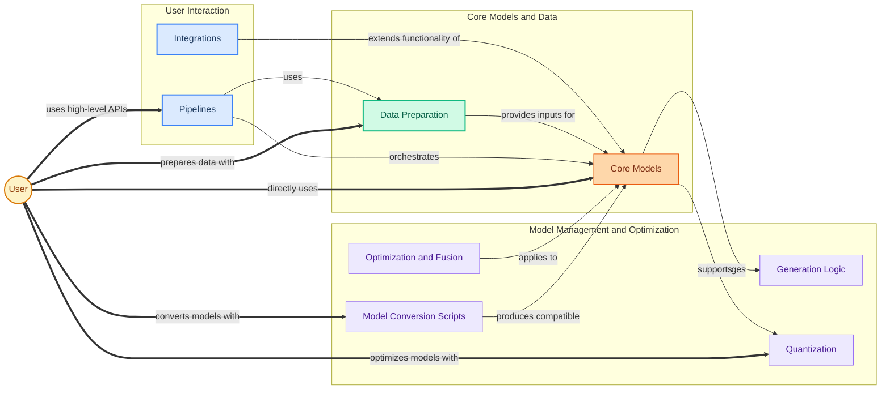

The `transformers` repository is a comprehensive library designed to provide state-of-the-art pre-trained models for various machine learning tasks across different modalities, including natural language processing, computer vision, and audio processing. It empowers researchers, developers, and data scientists to easily access, use, fine-tune, and deploy powerful transformer-based models.

The core problem it solves is democratizing access to advanced AI models by offering a unified, user-friendly interface for hundreds of architectures and millions of pre-trained weights. This significantly reduces the complexity and computational resources typically required to work with large-scale deep learning models.

New users and developers typically interact with the system through a few key workflows:

1.  **Running Inference with Pipelines:** The simplest entry point is using high-level `Pipelines` to perform common tasks like text classification, question answering, or image generation with minimal code.
2.  **Direct Model Loading and Fine-tuning:** For more control, users can load specific `Core Models` (e.g., for language, vision, audio, or multimodal tasks) and their associated `Data Preparation` tools (like tokenizers and image processors) to fine-tune them on custom datasets or integrate them into bespoke applications.
3.  **Model Optimization and Advanced Generation:** Users can leverage `Model Utilities` such as `Quantization` to reduce model size and increase inference speed, or explore advanced `Generation Logic` for more sophisticated text outputs.
4.  **Model Interoperability:** The `Model Conversion Scripts` allow users to convert models from other frameworks or formats into the Hugging Face `transformers` ecosystem, ensuring broad compatibility.

The library aims to simplify the adoption of complex deep learning models, fostering innovation and enabling a wide range of AI-powered applications.

