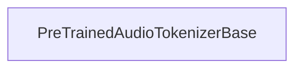

# part_1
This module introduces `PreTrainedAudioTokenizerBase`, an abstract class for audio tokenizers. It defines essential methods for encoding raw audio into discrete codebooks and decoding them back, forming the foundation for various audio processing models.

<!-- DIAGRAM_JSON
{
    "nodes": [
        {
            "id": "src.transformers.modeling_utils.PreTrainedAudioTokenizerBase",
            "label": "PreTrainedAudioTokenizerBase",
            "metadata": {
                "type": "class"
            }
        }
    ],
    "edges": [],
    "groups": []
}
-->
