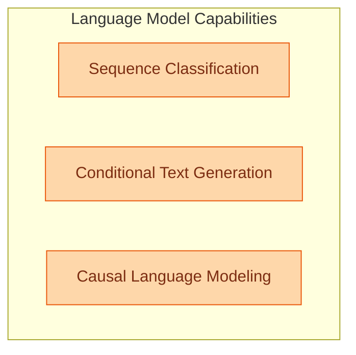

# Language Models for Classification and Generation
This module encompasses various language models specialized in sequence classification, conditional text generation, and causal language modeling, utilizing architectures like MT5, NLLB-MoE, OLMoE, PegasusX, and PLBart.

<!-- DIAGRAM_JSON
{
    "direction": "TD",
    "nodes": [
        {
            "id": "sequence_classification",
            "label": "Sequence Classification",
            "type": "module",
            "link": "sequence_classification.md"
        },
        {
            "id": "conditional_generation",
            "label": "Conditional Text Generation",
            "type": "module",
            "link": "conditional_generation.md"
        },
        {
            "id": "causal_language_modeling",
            "label": "Causal Language Modeling",
            "type": "module",
            "link": "causal_language_modeling.md"
        }
    ],
    "edges": [],
    "groups": [
        {
            "id": "language_modeling",
            "label": "Language Model Capabilities",
            "role": "generative",
            "nodes": [
                "sequence_classification",
                "conditional_generation",
                "causal_language_modeling"
            ]
        }
    ]
}
-->
