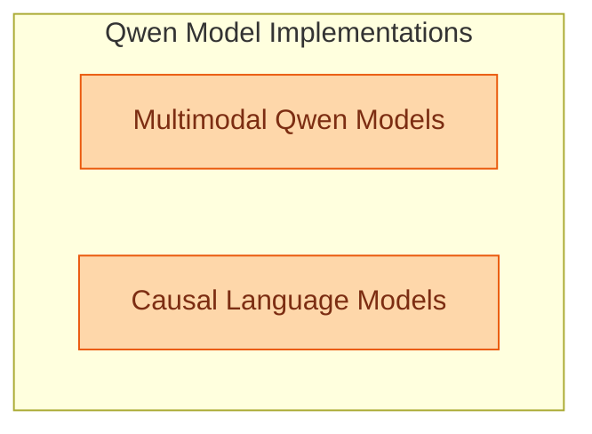

# Qwen Language Models
This module encompasses various Qwen language models, including multimodal capabilities with audio generation from Qwen2.5 Omni, alongside causal language models like Qwen2 MoE and Qwen3.5 for text generation.
<!-- DIAGRAM_JSON
{
    "direction": "TD",
    "nodes": [
        {
            "id": "multimodal_qwen_models",
            "label": "Multimodal Qwen Models",
            "type": "module",
            "link": "multimodal_qwen_models.md"
        },
        {
            "id": "causal_language_models",
            "label": "Causal Language Models",
            "type": "module",
            "link": "causal_language_models.md"
        }
    ],
    "edges": [],
    "groups": [
        {
            "id": "qwen_implementations",
            "label": "Qwen Model Implementations",
            "role": "generative",
            "nodes": [
                "multimodal_qwen_models",
                "causal_language_models"
            ]
        }
    ]
}
-->
