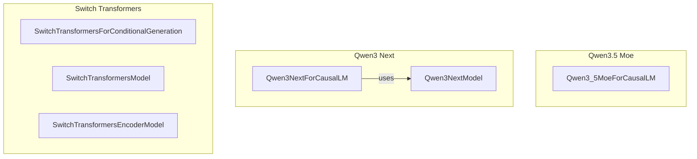

# part_13
This module defines core model and causal language model classes for Qwen3.5 Moe, Qwen3 Next, and Switch Transformers architectures, highlighting their structural relationships.

<!-- DIAGRAM_JSON
{
    "nodes": [
        {
            "id": "A",
            "label": "Qwen3_5MoeForCausalLM"
        },
        {
            "id": "B",
            "label": "Qwen3NextForCausalLM"
        },
        {
            "id": "C",
            "label": "Qwen3NextModel"
        },
        {
            "id": "D",
            "label": "SwitchTransformersForConditionalGeneration"
        },
        {
            "id": "E",
            "label": "SwitchTransformersModel"
        },
        {
            "id": "F",
            "label": "SwitchTransformersEncoderModel"
        }
    ],
    "edges": [
        {
            "source": "B",
            "target": "C",
            "label": "uses"
        }
    ],
    "groups": [
        {
            "id": "Qwen3_5_Moe",
            "label": "Qwen3.5 Moe",
            "nodes": [
                "A"
            ]
        },
        {
            "id": "Qwen3_Next",
            "label": "Qwen3 Next",
            "nodes": [
                "B",
                "C"
            ]
        },
        {
            "id": "SwitchTransformers",
            "label": "Switch Transformers",
            "nodes": [
                "D",
                "E",
                "F"
            ]
        }
    ]
}
-->
