# part_14
This module defines various SwitchTransformers and T5Gemma models, including sequence classification, token classification, and conditional generation, extending base pre-trained models.

<!-- DIAGRAM_JSON
{
  "nodes": [
    {"id": "SwitchTransformersModel", "label": "SwitchTransformersModel", "path": "src.transformers.models.switch_transformers.modular_switch_transformers.SwitchTransformersModel"},
    {"id": "SwitchTransformersEncoderModel", "label": "SwitchTransformersEncoderModel", "path": "src.transformers.models.switch_transformers.modular_switch_transformers.SwitchTransformersEncoderModel"},
    {"id": "T5ForSequenceClassification", "label": "T5ForSequenceClassification", "path": "src.transformers.models.t5.modeling_t5.T5ForSequenceClassification"},
    {"id": "T5GemmaForSequenceClassification_modeling", "label": "T5GemmaForSequenceClassification", "path": "src.transformers.models.t5gemma.modeling_t5gemma.T5GemmaForSequenceClassification"},
    {"id": "T5GemmaForTokenClassification", "label": "T5GemmaForTokenClassification", "path": "src.transformers.models.t5gemma.modeling_t5gemma.T5GemmaForTokenClassification"},
    {"id": "T5GemmaForConditionalGeneration", "label": "T5GemmaForConditionalGeneration", "path": "src.transformers.models.t5gemma.modeling_t5gemma.T5GemmaForConditionalGeneration"},
    {"id": "T5GemmaForSequenceClassification_modular", "label": "T5GemmaForSequenceClassification", "path": "src.transformers.models.t5gemma.modular_t5gemma.T5GemmaForSequenceClassification"},

    {"id": "SwitchTransformersPreTrainedModel", "label": "SwitchTransformersPreTrainedModel", "path": "Base Class", "is_utility": true},
    {"id": "SwitchTransformersStack", "label": "SwitchTransformersStack", "path": "Utility Class", "is_utility": true},
    {"id": "T5PreTrainedModel", "label": "T5PreTrainedModel", "path": "Base Class", "is_utility": true},
    {"id": "T5Model", "label": "T5Model", "path": "Utility Class", "is_utility": true},
    {"id": "T5ClassificationHead", "label": "T5ClassificationHead", "path": "Utility Class", "is_utility": true},
    {"id": "T5GemmaPreTrainedModel", "label": "T5GemmaPreTrainedModel", "path": "Base Class", "is_utility": true},
    {"id": "T5GemmaModel", "label": "T5GemmaModel", "path": "Utility Class", "is_utility": true},
    {"id": "T5GemmaEncoderModel", "label": "T5GemmaEncoderModel", "path": "Utility Class", "is_utility": true},
    {"id": "T5GemmaClassificationHead", "label": "T5GemmaClassificationHead", "path": "Utility Class", "is_utility": true},
    {"id": "GenerationMixin", "label": "GenerationMixin", "path": "Base Class", "is_utility": true},
    {"id": "T5GemmaLMHead", "label": "T5GemmaLMHead", "path": "Utility Class", "is_utility": true}
  ],
  "edges": [
    {"source": "SwitchTransformersModel", "target": "SwitchTransformersPreTrainedModel", "type": "inheritance"},
    {"source": "SwitchTransformersModel", "target": "SwitchTransformersStack", "type": "composition"},
    {"source": "SwitchTransformersEncoderModel", "target": "SwitchTransformersPreTrainedModel", "type": "inheritance"},
    {"source": "SwitchTransformersEncoderModel", "target": "SwitchTransformersStack", "type": "composition"},

    {"source": "T5ForSequenceClassification", "target": "T5PreTrainedModel", "type": "inheritance"},
    {"source": "T5ForSequenceClassification", "target": "T5Model", "type": "composition"},
    {"source": "T5ForSequenceClassification", "target": "T5ClassificationHead", "type": "composition"},

    {"source": "T5GemmaForSequenceClassification_modeling", "target": "T5GemmaPreTrainedModel", "type": "inheritance"},
    {"source": "T5GemmaForSequenceClassification_modeling", "target": "T5GemmaModel", "type": "composition"},
    {"source": "T5GemmaForSequenceClassification_modeling", "target": "T5GemmaEncoderModel", "type": "composition"},
    {"source": "T5GemmaForSequenceClassification_modeling", "target": "T5GemmaClassificationHead", "type": "composition"},

    {"source": "T5GemmaForTokenClassification", "target": "T5GemmaPreTrainedModel", "type": "inheritance"},
    {"source": "T5GemmaForTokenClassification", "target": "T5GemmaModel", "type": "composition"},
    {"source": "T5GemmaForTokenClassification", "target": "T5GemmaEncoderModel", "type": "composition"},
    {"source": "T5GemmaForTokenClassification", "target": "T5GemmaClassificationHead", "type": "composition"},

    {"source": "T5GemmaForConditionalGeneration", "target": "T5GemmaPreTrainedModel", "type": "inheritance"},
    {"source": "T5GemmaForConditionalGeneration", "target": "GenerationMixin", "type": "inheritance"},
    {"source": "T5GemmaForConditionalGeneration", "target": "T5GemmaModel", "type": "composition"},
    {"source": "T5GemmaForConditionalGeneration", "target": "T5GemmaLMHead", "type": "composition"},

    {"source": "T5GemmaForSequenceClassification_modular", "target": "T5GemmaPreTrainedModel", "type": "inheritance"},
    {"source": "T5GemmaForSequenceClassification_modular", "target": "T5GemmaModel", "type": "composition"},
    {"source": "T5GemmaForSequenceClassification_modular", "target": "T5GemmaEncoderModel", "type": "composition"},
    {"source": "T5GemmaForSequenceClassification_modular", "target": "T5GemmaClassificationHead", "type": "composition"}
  ],
  "groups": [
    {"id": "grp_switch_transformers", "label": "src.transformers.models.switch_transformers.modular_switch_transformers", "members": ["SwitchTransformersModel", "SwitchTransformersEncoderModel"]},
    {"id": "grp_t5", "label": "src.transformers.models.t5.modeling_t5", "members": ["T5ForSequenceClassification"]},
    {"id": "grp_t5gemma_modeling", "label": "src.transformers.models.t5gemma.modeling_t5gemma", "members": ["T5GemmaForSequenceClassification_modeling", "T5GemmaForTokenClassification", "T5GemmaForConditionalGeneration"]},
    {"id": "grp_t5gemma_modular", "label": "src.transformers.models.t5gemma.modular_t5gemma", "members": ["T5GemmaForSequenceClassification_modular"]}
  ]
}
-->

```mermaid
flowchart TD
    subgraph src.transformers.models.switch_transformers.modular_switch_transformers
        SwitchTransformersModel["SwitchTransformersModel"]
        SwitchTransformersEncoderModel["SwitchTransformersEncoderModel"]
    end

    subgraph src.transformers.models.t5.modeling_t5
        T5ForSequenceClassification["T5ForSequenceClassification"]
    end

    subgraph src.transformers.models.t5gemma.modeling_t5gemma
        T5GemmaForSequenceClassification_modeling["T5GemmaForSequenceClassification"]
        T5GemmaForTokenClassification["T5GemmaForTokenClassification"]
        T5GemmaForConditionalGeneration["T5GemmaForConditionalGeneration"]
    end

    subgraph src.transformers.models.t5gemma.modular_t5gemma
        T5GemmaForSequenceClassification_modular["T5GemmaForSequenceClassification"]
    end

    SwitchTransformersPreTrainedModel[SwitchTransformersPreTrainedModel]
    SwitchTransformersStack[SwitchTransformersStack]
    T5PreTrainedModel[T5PreTrainedModel]
    T5Model[T5Model]
    T5ClassificationHead[T5ClassificationHead]
    T5GemmaPreTrainedModel[T5GemmaPreTrainedModel]
    T5GemmaModel[T5GemmaModel]
    T5GemmaEncoderModel[T5GemmaEncoderModel]
    T5GemmaClassificationHead[T5GemmaClassificationHead]
    GenerationMixin[GenerationMixin]
    T5GemmaLMHead[T5GemmaLMHead]

    SwitchTransformersModel -->|"inherits"| SwitchTransformersPreTrainedModel
    SwitchTransformersModel ---o SwitchTransformersStack
    SwitchTransformersEncoderModel -->|"inherits"| SwitchTransformersPreTrainedModel
    SwitchTransformersEncoderModel ---o SwitchTransformersStack

    T5ForSequenceClassification -->|"inherits"| T5PreTrainedModel
    T5ForSequenceClassification ---o T5Model
    T5ForSequenceClassification ---o T5ClassificationHead

    T5GemmaForSequenceClassification_modeling -->|"inherits"| T5GemmaPreTrainedModel
    T5GemmaForSequenceClassification_modeling ---o T5GemmaModel
    T5GemmaForSequenceClassification_modeling ---o T5GemmaEncoderModel
    T5GemmaForSequenceClassification_modeling ---o T5GemmaClassificationHead

    T5GemmaForTokenClassification -->|"inherits"| T5GemmaPreTrainedModel
    T5GemmaForTokenClassification ---o T5GemmaModel
    T5GemmaForTokenClassification ---o T5GemmaEncoderModel
    T5GemmaForTokenClassification ---o T5GemmaClassificationHead

    T5GemmaForConditionalGeneration -->|"inherits"| T5GemmaPreTrainedModel
    T5GemmaForConditionalGeneration -->|"inherits"| GenerationMixin
    T5GemmaForConditionalGeneration ---o T5GemmaModel
    T5GemmaForConditionalGeneration ---o T5GemmaLMHead

    T5GemmaForSequenceClassification_modular -->|"inherits"| T5GemmaPreTrainedModel
    T5GemmaForSequenceClassification_modular ---o T5GemmaModel
    T5GemmaForSequenceClassification_modular ---o T5GemmaEncoderModel
    T5GemmaForSequenceClassification_modular ---o T5GemmaClassificationHead

    classDef component fill:#add8e6,stroke:#333,stroke-width:2px;
    classDef base fill:#f9f,stroke:#333,stroke-width:2px;
    classDef utility fill:#eee,stroke:#333,stroke-width:1px;

    class SwitchTransformersModel,SwitchTransformersEncoderModel,T5ForSequenceClassification,T5GemmaForSequenceClassification_modeling,T5GemmaForTokenClassification,T5GemmaForConditionalGeneration,T5GemmaForSequenceClassification_modular component
    class SwitchTransformersPreTrainedModel,T5PreTrainedModel,T5GemmaPreTrainedModel,GenerationMixin base
    class SwitchTransformersStack,T5Model,T5ClassificationHead,T5GemmaModel,T5GemmaEncoderModel,T5GemmaClassificationHead,T5GemmaLMHead utility
```
