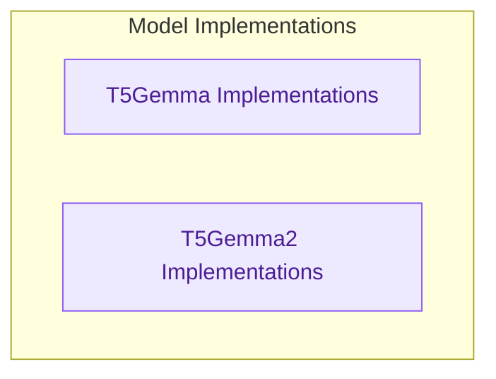

# T5Gemma and T5Gemma2 Model Implementations

This module provides specialized T5Gemma and T5Gemma2 models, enabling conditional text generation, sequence classification, and token classification capabilities. It extends the core T5Gemma and T5Gemma2 architectures for diverse NLP applications.

<!-- DIAGRAM_JSON
{
    "direction": "TD",
    "nodes": [
        {
            "id": "t5gemma_impl",
            "label": "T5Gemma Implementations",
            "type": "module",
            "link": "t5gemma_models.md"
        },
        {
            "id": "t5gemma2_impl",
            "label": "T5Gemma2 Implementations",
            "type": "module",
            "link": "t5gemma2_models.md"
        }
    ],
    "edges": [],
    "groups": [
        {
            "id": "model_implementations",
            "label": "Model Implementations",
            "role": "analytical",
            "nodes": [
                "t5gemma_impl",
                "t5gemma2_impl"
            ]
        }
    ]
}
-->
