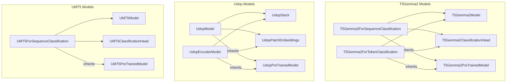

# part_16
This module defines classification models for T5Gemma2 and UMT5, and core encoder-decoder/encoder-only models for Udop, covering various NLP and multimodal tasks.

<!-- DIAGRAM_JSON
{
    "nodes": [
        {
            "id": "part_16",
            "label": "part_16",
            "type": "module"
        },
        {
            "id": "T5Gemma2ForSequenceClassification",
            "label": "T5Gemma2ForSequenceClassification",
            "type": "class"
        },
        {
            "id": "T5Gemma2ForTokenClassification",
            "label": "T5Gemma2ForTokenClassification",
            "type": "class"
        },
        {
            "id": "T5Gemma2Model",
            "label": "T5Gemma2Model",
            "type": "class"
        },
        {
            "id": "T5Gemma2ClassificationHead",
            "label": "T5Gemma2ClassificationHead",
            "type": "class"
        },
        {
            "id": "T5Gemma2PreTrainedModel",
            "label": "T5Gemma2PreTrainedModel",
            "type": "class"
        },
        {
            "id": "UdopModel",
            "label": "UdopModel",
            "type": "class"
        },
        {
            "id": "UdopEncoderModel",
            "label": "UdopEncoderModel",
            "type": "class"
        },
        {
            "id": "UdopStack",
            "label": "UdopStack",
            "type": "class"
        },
        {
            "id": "UdopPatchEmbeddings",
            "label": "UdopPatchEmbeddings",
            "type": "class"
        },
        {
            "id": "UdopPreTrainedModel",
            "label": "UdopPreTrainedModel",
            "type": "class"
        },
        {
            "id": "UMT5ForSequenceClassification",
            "label": "UMT5ForSequenceClassification",
            "type": "class"
        },
        {
            "id": "UMT5Model",
            "label": "UMT5Model",
            "type": "class"
        },
        {
            "id": "UMT5ClassificationHead",
            "label": "UMT5ClassificationHead",
            "type": "class"
        },
        {
            "id": "UMT5PreTrainedModel",
            "label": "UMT5PreTrainedModel",
            "type": "class"
        },
        {
            "id": "umt5_classification",
            "label": "UMT5 Sequence Classification",
            "type": "module",
            "link": "umt5_classification.md"
        },
        {
            "id": "udop_models",
            "label": "UDOP Unified Document Models",
            "type": "module",
            "link": "udop_models.md"
        },
        {
            "id": "t5gemma2_classification",
            "label": "T5Gemma2 Classification Models",
            "type": "module",
            "link": "t5gemma2_classification.md"
        }
    ],
    "edges": [
        {
            "source": "T5Gemma2ForSequenceClassification",
            "target": "T5Gemma2Model",
            "type": "uses"
        },
        {
            "source": "T5Gemma2ForSequenceClassification",
            "target": "T5Gemma2ClassificationHead",
            "type": "uses"
        },
        {
            "source": "T5Gemma2ForSequenceClassification",
            "target": "T5Gemma2PreTrainedModel",
            "type": "inherits"
        },
        {
            "source": "T5Gemma2ForTokenClassification",
            "target": "T5Gemma2Model",
            "type": "uses"
        },
        {
            "source": "T5Gemma2ForTokenClassification",
            "target": "T5Gemma2ClassificationHead",
            "type": "uses"
        },
        {
            "source": "T5Gemma2ForTokenClassification",
            "target": "T5Gemma2PreTrainedModel",
            "type": "inherits"
        },
        {
            "source": "UdopModel",
            "target": "UdopStack",
            "type": "uses"
        },
        {
            "source": "UdopModel",
            "target": "UdopPatchEmbeddings",
            "type": "uses"
        },
        {
            "source": "UdopModel",
            "target": "UdopPreTrainedModel",
            "type": "inherits"
        },
        {
            "source": "UdopEncoderModel",
            "target": "UdopStack",
            "type": "uses"
        },
        {
            "source": "UdopEncoderModel",
            "target": "UdopPatchEmbeddings",
            "type": "uses"
        },
        {
            "source": "UdopEncoderModel",
            "target": "UdopPreTrainedModel",
            "type": "inherits"
        },
        {
            "source": "UMT5ForSequenceClassification",
            "target": "UMT5Model",
            "type": "uses"
        },
        {
            "source": "UMT5ForSequenceClassification",
            "target": "UMT5ClassificationHead",
            "type": "uses"
        },
        {
            "source": "UMT5ForSequenceClassification",
            "target": "UMT5PreTrainedModel",
            "type": "inherits"
        },
        {
            "source": "part_16",
            "target": "umt5_classification"
        },
        {
            "source": "part_16",
            "target": "udop_models"
        },
        {
            "source": "part_16",
            "target": "t5gemma2_classification"
        }
    ],
    "groups": [
        {
            "id": "T5Gemma2",
            "label": "T5Gemma2 Models",
            "nodes": [
                "T5Gemma2ForSequenceClassification",
                "T5Gemma2ForTokenClassification",
                "T5Gemma2Model",
                "T5Gemma2ClassificationHead",
                "T5Gemma2PreTrainedModel"
            ]
        },
        {
            "id": "Udop",
            "label": "Udop Models",
            "nodes": [
                "UdopModel",
                "UdopEncoderModel",
                "UdopStack",
                "UdopPatchEmbeddings",
                "UdopPreTrainedModel"
            ]
        },
        {
            "id": "UMT5",
            "label": "UMT5 Models",
            "nodes": [
                "UMT5ForSequenceClassification",
                "UMT5Model",
                "UMT5ClassificationHead",
                "UMT5PreTrainedModel"
            ]
        }
    ]
}
-->

