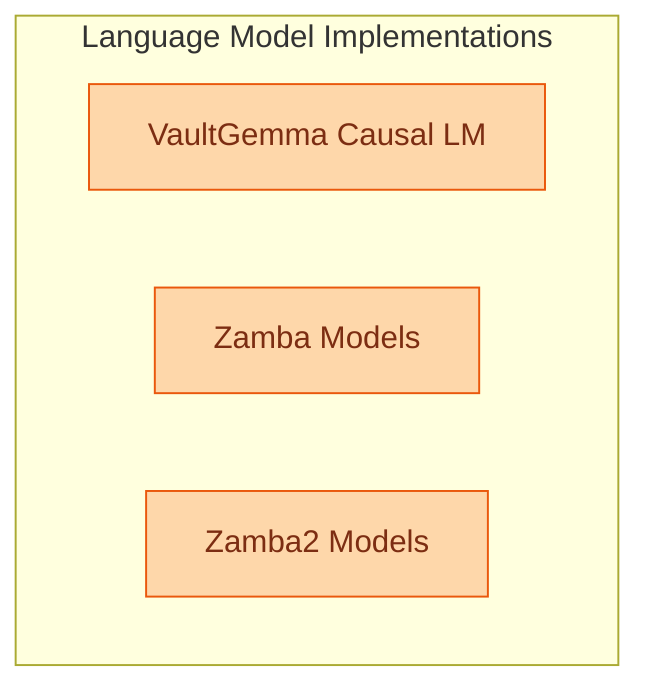

# Language Model Implementations
This module houses various language model implementations, including VaultGemma for causal language modeling and Zamba/Zamba2 for both causal language modeling and sequence classification, providing robust text generation and understanding capabilities.

<!-- DIAGRAM_JSON
{
    "direction": "TD",
    "nodes": [
        {
            "id": "vaultgemma_causal_lm",
            "label": "VaultGemma Causal LM",
            "type": "module",
            "link": "vaultgemma_causal_lm.md"
        },
        {
            "id": "zamba_models",
            "label": "Zamba Models",
            "type": "module",
            "link": "zamba_models.md"
        },
        {
            "id": "zamba2_models",
            "label": "Zamba2 Models",
            "type": "module",
            "link": "zamba2_models.md"
        }
    ],
    "edges": [],
    "groups": [
        {
            "id": "language_model_implementations",
            "label": "Language Model Implementations",
            "role": "generative",
            "nodes": [
                "vaultgemma_causal_lm",
                "zamba_models",
                "zamba2_models"
            ]
        }
    ]
}
-->
