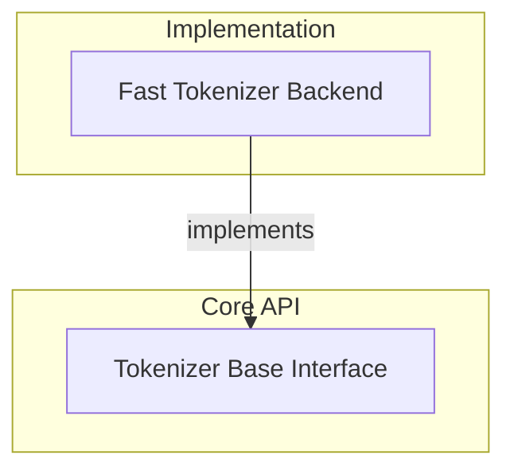

# Tokenization Utilities and Backend Integration

This module provides the abstract base class for all tokenizers and a concrete implementation that leverages the HuggingFace `tokenizers` library for efficient text processing, including managing special tokens, encoding, decoding, and padding strategies.

<!-- DIAGRAM_JSON
{
    "direction": "TD",
    "nodes": [
        {"id": "tokenizer_base_interface", "label": "Tokenizer Base Interface", "type": "module", "link": "tokenizer_base_interface.md"},
        {"id": "fast_tokenizer_backend", "label": "Fast Tokenizer Backend", "type": "module", "link": "fast_tokenizer_backend.md"}
    ],
    "edges": [
        {"source": "fast_tokenizer_backend", "target": "tokenizer_base_interface", "label": "implements"}
    ],
    "groups": [
        {"id": "core_api", "label": "Core API", "role": "analytical", "nodes": ["tokenizer_base_interface"]},
        {"id": "implementation", "label": "Implementation", "role": "analytical", "nodes": ["fast_tokenizer_backend"]}
    ]
}
-->
