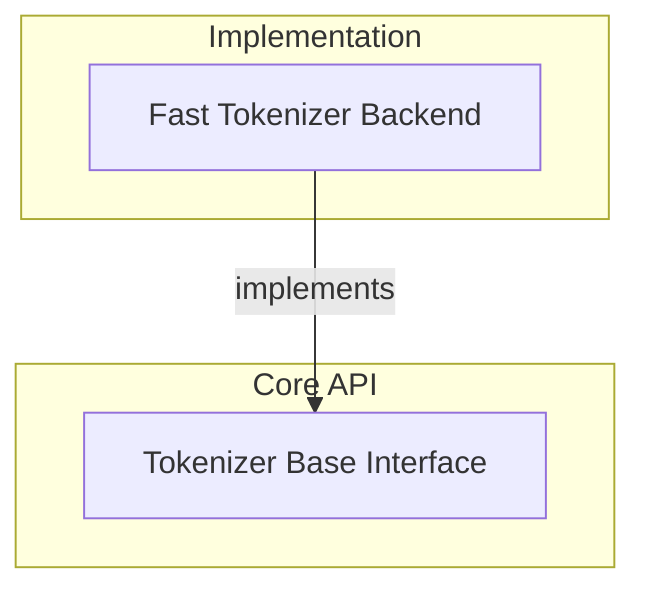

# Tokenization Utilities and Backend Integration

This module provides the abstract base class for all tokenizers and a concrete implementation that leverages the HuggingFace `tokenizers` library for efficient text processing, including managing special tokens, encoding, decoding, and padding strategies.

<!-- DIAGRAM_JSON
{
    "direction": "TD",
    "nodes": [
        {
            "id": "part_2",
            "label": "Part 2",
            "type": "module"
        },
        {
            "id": "c0",
            "label": "convert_dpt_checkpoint",
            "type": "component"
        },
        {
            "id": "c1",
            "label": "convert_dpt_checkpoint",
            "type": "component"
        },
        {
            "id": "c2",
            "label": "convert_edgetam_checkpoint",
            "type": "component"
        },
        {
            "id": "c3",
            "label": "convert_edgetam_checkpoint",
            "type": "component"
        },
        {
            "id": "c4",
            "label": "write_model",
            "type": "component"
        },
        {
            "id": "more",
            "label": "+18 more",
            "type": "component"
        }
    ],
    "edges": [
        {
            "source": "part_2",
            "target": "c0"
        },
        {
            "source": "part_2",
            "target": "c1"
        },
        {
            "source": "part_2",
            "target": "c2"
        },
        {
            "source": "part_2",
            "target": "c3"
        },
        {
            "source": "part_2",
            "target": "c4"
        },
        {
            "source": "part_2",
            "target": "more"
        }
    ],
    "groups": [],
    "_auto_generated": true
}
-->
