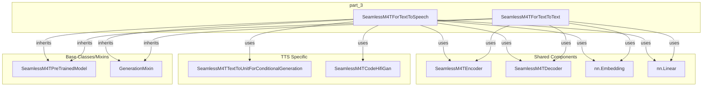

# part_3
The `part_3` module defines `SeamlessM4TForTextToSpeech` and `SeamlessM4TForTextToText` models. These classes provide capabilities for text-to-speech generation and text-to-text translation within the SeamlessM4T framework, sharing core encoder-decoder components.

<!-- DIAGRAM_JSON
{
  "nodes": [
    {"id": "SeamlessM4TForTextToSpeech", "label": "SeamlessM4TForTextToSpeech"},
    {"id": "SeamlessM4TForTextToText", "label": "SeamlessM4TForTextToText"},
    {"id": "SeamlessM4TEncoder", "label": "SeamlessM4TEncoder"},
    {"id": "SeamlessM4TDecoder", "label": "SeamlessM4TDecoder"},
    {"id": "SeamlessM4TTextToUnitForConditionalGeneration", "label": "SeamlessM4TTextToUnitForConditionalGeneration"},
    {"id": "SeamlessM4TCodeHifiGan", "label": "SeamlessM4TCodeHifiGan"},
    {"id": "SeamlessM4TPreTrainedModel", "label": "SeamlessM4TPreTrainedModel"},
    {"id": "GenerationMixin", "label": "GenerationMixin"},
    {"id": "nn.Embedding", "label": "nn.Embedding"},
    {"id": "nn.Linear", "label": "nn.Linear"}
  ],
  "edges": [
    {"source": "SeamlessM4TForTextToSpeech", "target": "SeamlessM4TPreTrainedModel", "label": "inherits"},
    {"source": "SeamlessM4TForTextToSpeech", "target": "GenerationMixin", "label": "inherits"},
    {"source": "SeamlessM4TForTextToSpeech", "target": "SeamlessM4TEncoder", "label": "uses"},
    {"source": "SeamlessM4TForTextToSpeech", "target": "SeamlessM4TDecoder", "label": "uses"},
    {"source": "SeamlessM4TForTextToSpeech", "target": "SeamlessM4TTextToUnitForConditionalGeneration", "label": "uses"},
    {"source": "SeamlessM4TForTextToSpeech", "target": "SeamlessM4TCodeHifiGan", "label": "uses"},
    {"source": "SeamlessM4TForTextToSpeech", "target": "nn.Embedding", "label": "uses"},
    {"source": "SeamlessM4TForTextToSpeech", "target": "nn.Linear", "label": "uses"},
    {"source": "SeamlessM4TForTextToText", "target": "SeamlessM4TPreTrainedModel", "label": "inherits"},
    {"source": "SeamlessM4TForTextToText", "target": "GenerationMixin", "label": "inherits"},
    {"source": "SeamlessM4TForTextToText", "target": "SeamlessM4TEncoder", "label": "uses"},
    {"source": "SeamlessM4TForTextToText", "target": "SeamlessM4TDecoder", "label": "uses"},
    {"source": "SeamlessM4TForTextToText", "target": "nn.Embedding", "label": "uses"},
    {"source": "SeamlessM4TForTextToText", "target": "nn.Linear", "label": "uses"}
  ],
  "groups": [
    {"id": "part_3", "label": "part_3", "nodes": ["SeamlessM4TForTextToSpeech", "SeamlessM4TForTextToText"]},
    {"id": "Shared Components", "label": "Shared Components", "nodes": ["SeamlessM4TEncoder", "SeamlessM4TDecoder", "nn.Embedding", "nn.Linear"]},
    {"id": "TTS Specific", "label": "TTS Specific", "nodes": ["SeamlessM4TTextToUnitForConditionalGeneration", "SeamlessM4TCodeHifiGan"]},
    {"id": "Base Classes/Mixins", "label": "Base Classes/Mixins", "nodes": ["SeamlessM4TPreTrainedModel", "GenerationMixin"]}
  ]
}
-->
