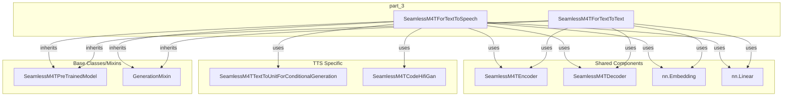

# part_3
The `part_3` module defines `SeamlessM4TForTextToSpeech` and `SeamlessM4TForTextToText` models. These classes provide capabilities for text-to-speech generation and text-to-text translation within the SeamlessM4T framework, sharing core encoder-decoder components.

<!-- DIAGRAM_JSON
{
    "direction": "TD",
    "nodes": [
        {
            "id": "part_3",
            "label": "Part 3",
            "type": "module"
        },
        {
            "id": "c0",
            "label": "main",
            "type": "component"
        },
        {
            "id": "c1",
            "label": "convert_maskformer_checkpoint",
            "type": "component"
        },
        {
            "id": "c2",
            "label": "convert_maskformer_checkpoint",
            "type": "component"
        },
        {
            "id": "c3",
            "label": "convert_checkpoint",
            "type": "component"
        },
        {
            "id": "c4",
            "label": "main",
            "type": "component"
        },
        {
            "id": "more",
            "label": "+13 more",
            "type": "component"
        }
    ],
    "edges": [
        {
            "source": "part_3",
            "target": "c0"
        },
        {
            "source": "part_3",
            "target": "c1"
        },
        {
            "source": "part_3",
            "target": "c2"
        },
        {
            "source": "part_3",
            "target": "c3"
        },
        {
            "source": "part_3",
            "target": "c4"
        },
        {
            "source": "part_3",
            "target": "more"
        }
    ],
    "groups": [],
    "_auto_generated": true
}
-->
