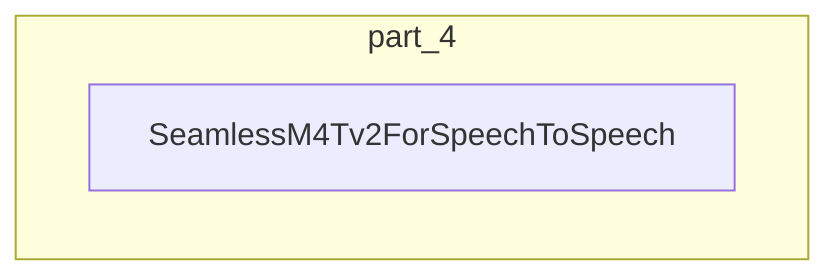

# part_4
This module defines the `SeamlessM4Tv2ForSpeechToSpeech` model, designed for direct speech-to-speech translation. It integrates a speech encoder, text decoder, and a vocoder to process and generate audio.

<!-- DIAGRAM_JSON
{
    "direction": "TD",
    "nodes": [
        {
            "id": "part_4",
            "label": "Part 4",
            "type": "module"
        },
        {
            "id": "c0",
            "label": "convert_pixio_checkpoint",
            "type": "component"
        },
        {
            "id": "c1",
            "label": "convert_rt_detr_checkpoint",
            "type": "component"
        },
        {
            "id": "c2",
            "label": "convert_sam_checkpoint",
            "type": "component"
        },
        {
            "id": "c3",
            "label": "convert_sam2_checkpoint",
            "type": "component"
        },
        {
            "id": "c4",
            "label": "convert_sam2_checkpoint",
            "type": "component"
        },
        {
            "id": "more",
            "label": "+15 more",
            "type": "component"
        }
    ],
    "edges": [
        {
            "source": "part_4",
            "target": "c0"
        },
        {
            "source": "part_4",
            "target": "c1"
        },
        {
            "source": "part_4",
            "target": "c2"
        },
        {
            "source": "part_4",
            "target": "c3"
        },
        {
            "source": "part_4",
            "target": "c4"
        },
        {
            "source": "part_4",
            "target": "more"
        }
    ],
    "groups": [],
    "_auto_generated": true
}
-->
