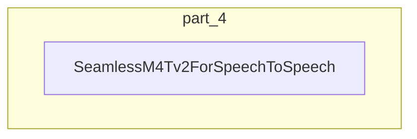

# part_4
This module defines the `SeamlessM4Tv2ForSpeechToSpeech` model, designed for direct speech-to-speech translation. It integrates a speech encoder, text decoder, and a vocoder to process and generate audio.

<!-- DIAGRAM_JSON
{
  "nodes": [
    {"id": "SeamlessM4Tv2ForSpeechToSpeech", "label": "SeamlessM4Tv2ForSpeechToSpeech", "class": "component"}
  ],
  "edges": [],
  "groups": [
    {"id": "part_4", "label": "part_4", "nodes": ["SeamlessM4Tv2ForSpeechToSpeech"]}
  ]
}
-->
