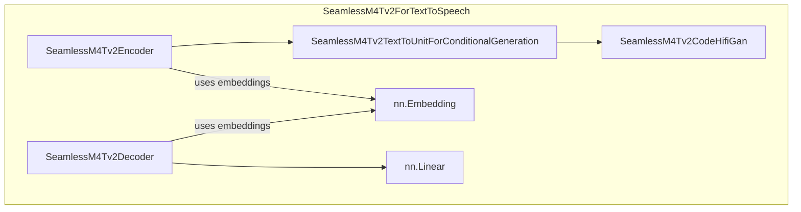

# part_6
This module implements the SeamlessM4Tv2 model for text-to-speech generation. It converts input text into spoken audio using an encoder-decoder architecture, a text-to-unit model, and a vocoder.

<!-- DIAGRAM_JSON
{
  "nodes": [
    {
      "id": "text_encoder",
      "label": "SeamlessM4Tv2Encoder"
    },
    {
      "id": "text_decoder",
      "label": "SeamlessM4Tv2Decoder"
    },
    {
      "id": "t2u_model",
      "label": "SeamlessM4Tv2TextToUnitForConditionalGeneration"
    },
    {
      "id": "vocoder",
      "label": "SeamlessM4Tv2CodeHifiGan"
    },
    {
      "id": "shared",
      "label": "nn.Embedding"
    },
    {
      "id": "lm_head",
      "label": "nn.Linear"
    }
  ],
  "edges": [
    {
      "source": "text_encoder",
      "target": "t2u_model",
      "label": "encodes text to units"
    },
    {
      "source": "t2u_model",
      "target": "vocoder",
      "label": "generates units for audio"
    },
    {
      "source": "text_encoder",
      "target": "shared",
      "label": "uses embeddings"
    },
    {
      "source": "text_decoder",
      "target": "shared",
      "label": "uses embeddings"
    },
    {
      "source": "text_decoder",
      "target": "lm_head",
      "label": "predicts tokens"
    }
  ],
  "groups": [
    {
      "id": "SeamlessM4Tv2ForTextToSpeech_group",
      "label": "SeamlessM4Tv2ForTextToSpeech",
      "nodes": [
        "text_encoder",
        "text_decoder",
        "t2u_model",
        "vocoder",
        "shared",
        "lm_head"
      ]
    }
  ]
}
-->
